## Download Brosur Rukan River Safari PIK 2 Jakarta
**Download brosur rukan River Safari PIK 2** yang telah dirilis perdana oleh pengembang PIK 2 secara resmi pada bulan Oktober-2023. Rukan baru PIK 2 Jakarta yang berlokasi sebelah [perumahan Pasir Putih Residences](https://pik2home.com/proyek/okinawa-pik-2-pasir-putih-residences/) dan wahana **River Safari PIK 2** dan mangrove.

[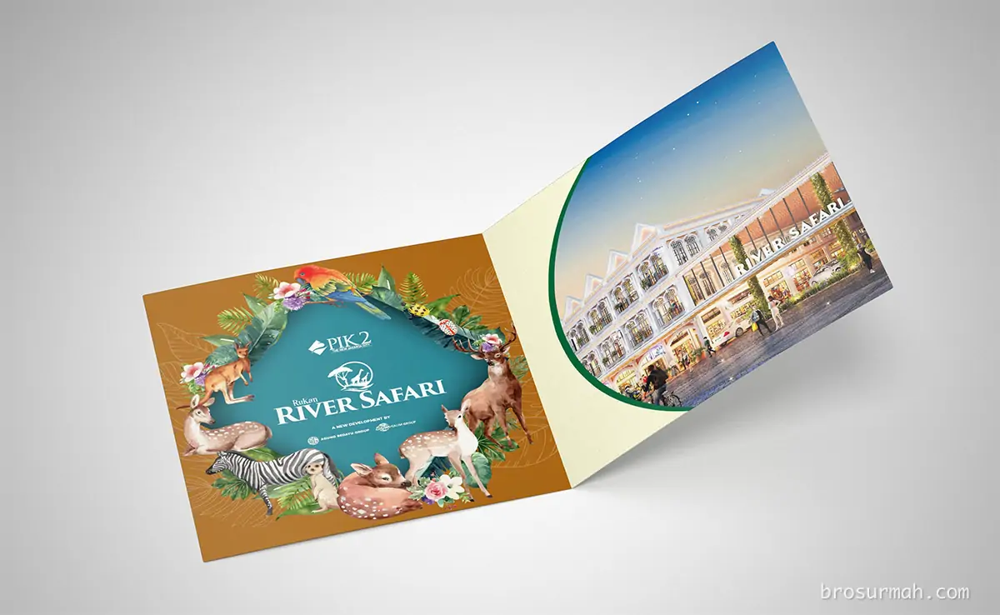](https://drive.google.com/drive/folders/1UqGO6G6hVE93U3IgMtPA7ZxNpvKQvt1g?usp=drive_link#?)

## Rukan River Safari PIK 2
**Rukan River Safari** adalah rukan terbaru PIK 2 Jakarta launching perdana 2023. [Rukan River Safari](https://pik2home.com/proyek/rukan-river-safari-pik-2-jakarta/) dijual perdana dengan fitur ruko alfreso dan lokasi premium di jalan boulevard Pasir Putih PIK2 dan wahana baru River Safari di kawasan Mangrove PIK 2.

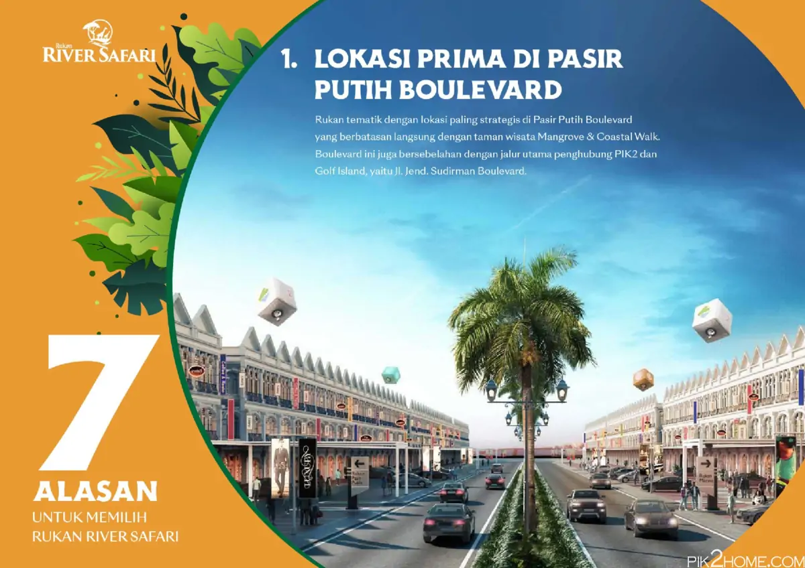

**Rukan River Safari PIK 2** memiliki keunggulan sebagai tempat usaha / bisnis, dimana memiliki potensi pengunjung yang besar. Melihat lokasi yang padat populasi dengan potensi besar dapat menjaring +/- 60 ribu penghuni yang berasal dari klaster perumahan sekitar rukan, seluruh penghuni PIK 2 dan pengunjung dari penjuru Jakarta.

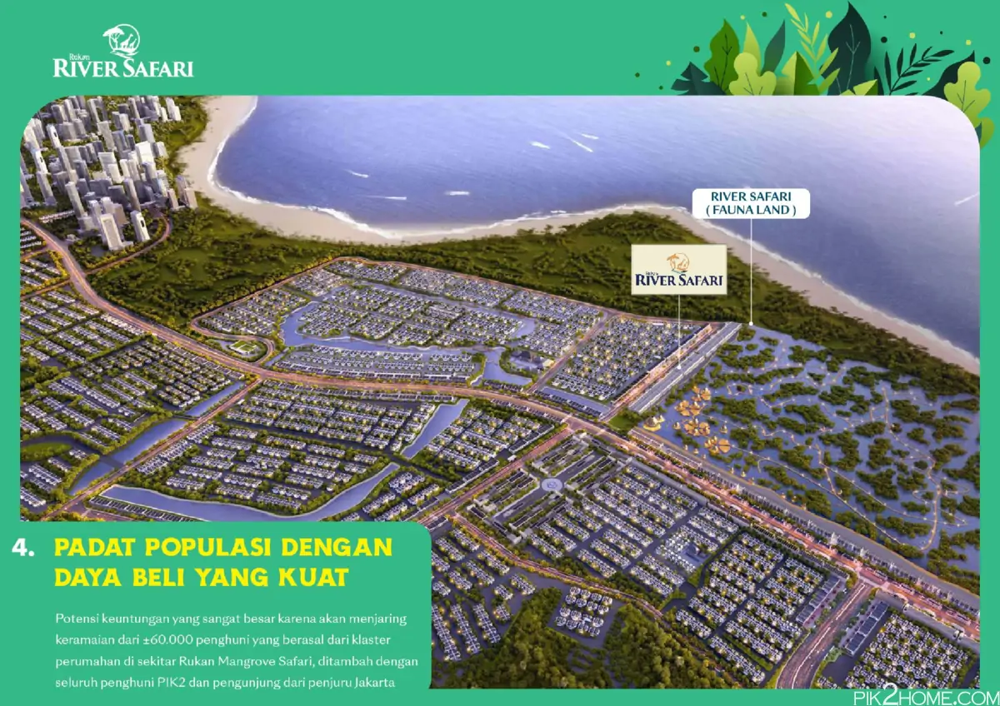

Selain daripada itu, lokasi rukan River Safari PIK 2 yang bersebelahan dengan wahana River Safari di kawasan Mangrove PIK 2 Jakarta, pastinya memberikan tambahan pengunjung rukan setiap harinya.

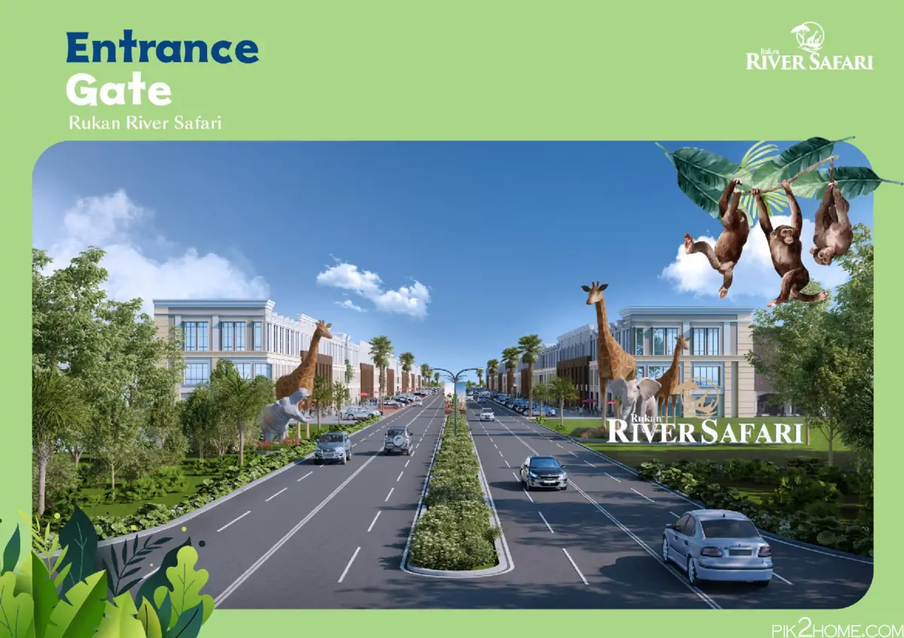

Saat launching perdana, [rukan River Safari PIK2](https://investproperti.com/rukan-river-safari-pik-2-jakarta/) dijual pada harga ruko mulai daripada Rp.6,6 milyaran*. Untuk harga rukan terbaru, langsung saja hubungi [sales rukan PIK 2](https://pik2home.com/hubungi-kami/) untuk mendapatkan harga paling terkini.

Beberapa pilihan rukan River Safari dipasarkan perdana dengan 4 pilihan tipe sebagai berikut:

### Tipe 4,5x18
Pilihan rukan River Safari tipe 4,5x18 meter memiliki 3 lantai bangunan dengan fasad menghadap ke jalan boulevard. Fitur ruko dengan terrace, area al-fresco yang bersifat opsional oleh pemilik, dan memiliki rooftop.
- Luas tanah: 81 m2
- Luas bangunan: 236 m2.

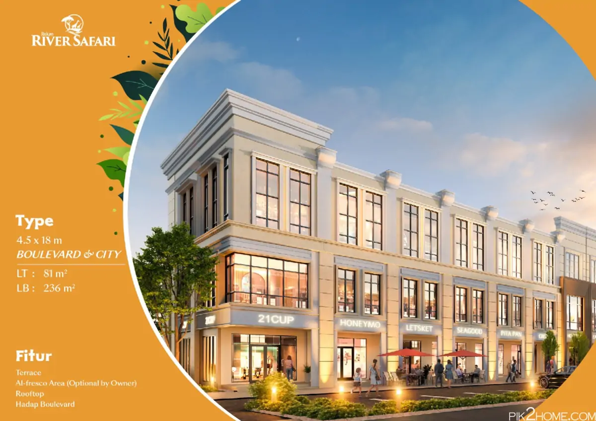
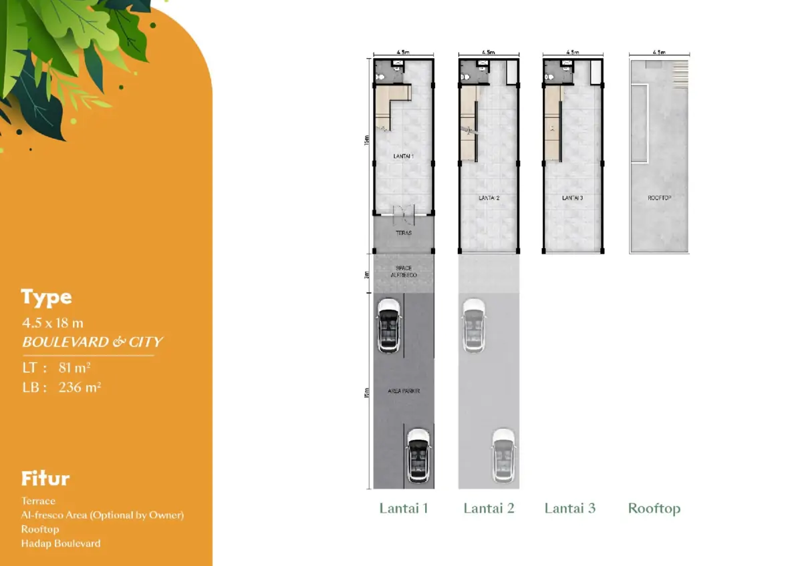

### Tipe 6x18
Pilihan rukan River Safari tipe 6x18 meter memiliki 3 lantai bangunan dengan fasad menghadap ke mangrove PIK. Fitur ruko dengan terrace, area al-fresco yang bersifat opsional oleh pemilik, dan memiliki rooftop.
- Luas tanah: 108 m2
- Luas bangunan: 315 m2.

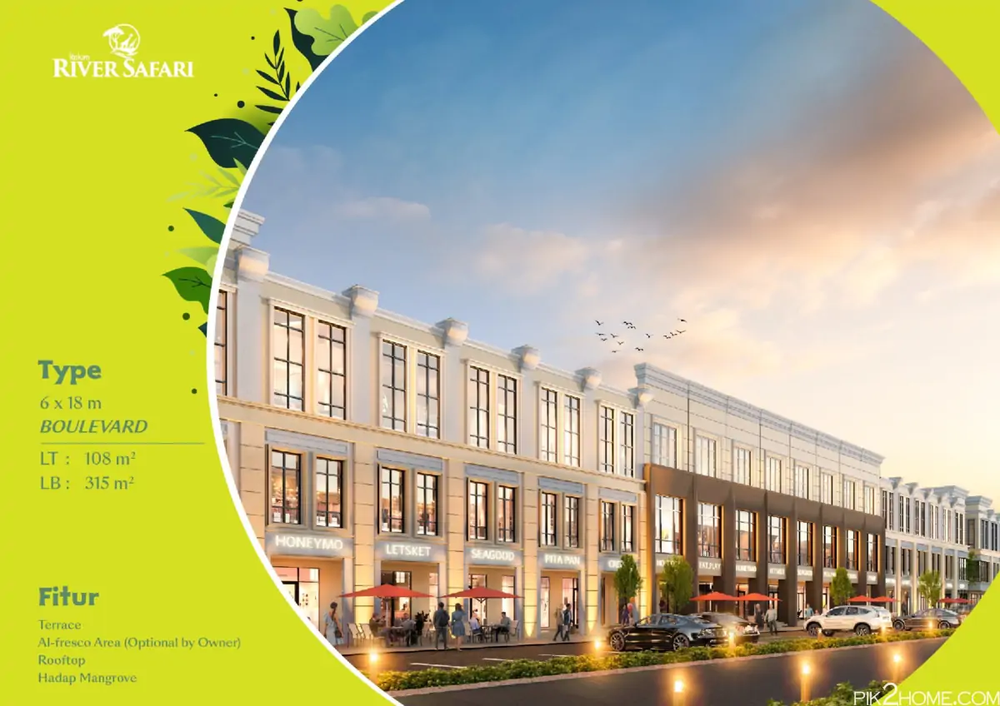
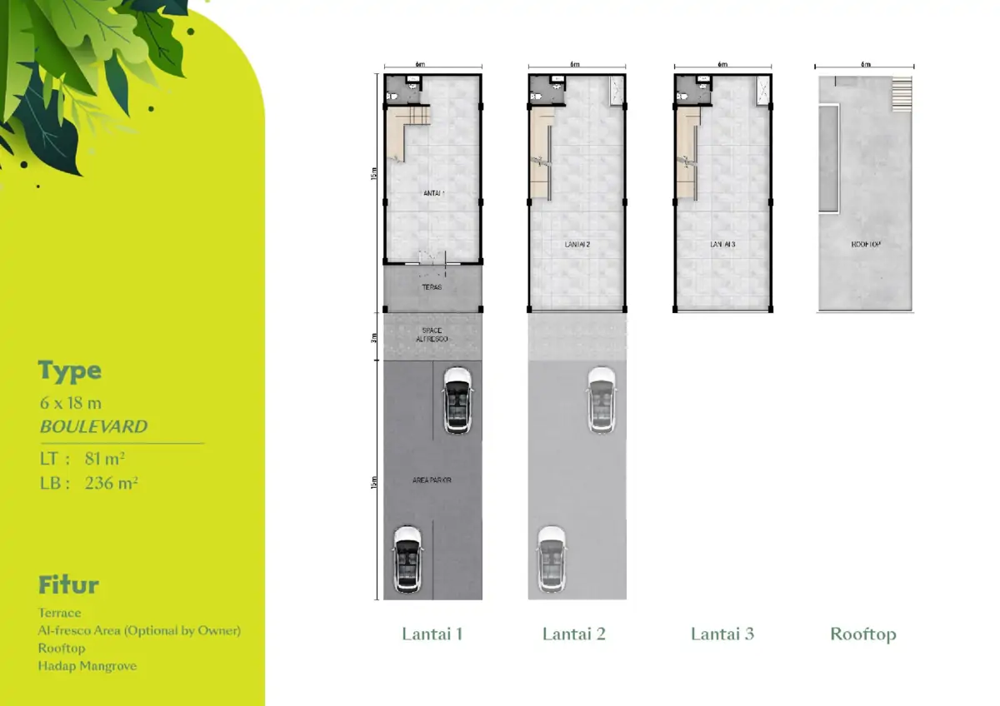

### Tipe 4,5x20
Pilihan rukan River Safari tipe 4,5x20 meter memiliki 3 lantai bangunan dengan fasad menghadap ke mangrove PIK. Fitur ruko dengan terrace, area al-fresco yang bersifat opsional oleh pemilik, balkoni dan memiliki rooftop.
- Luas tanah: 90 m2
- Luas bangunan: 293 m2.

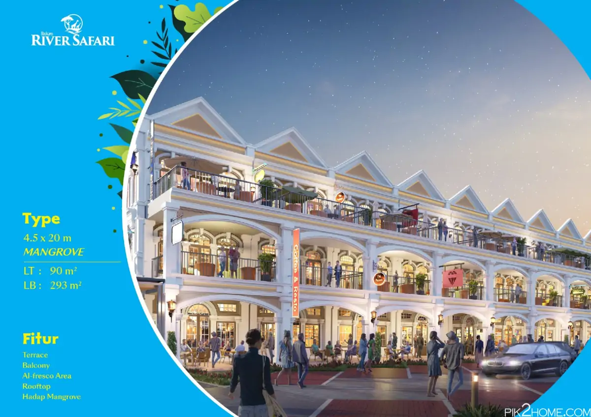
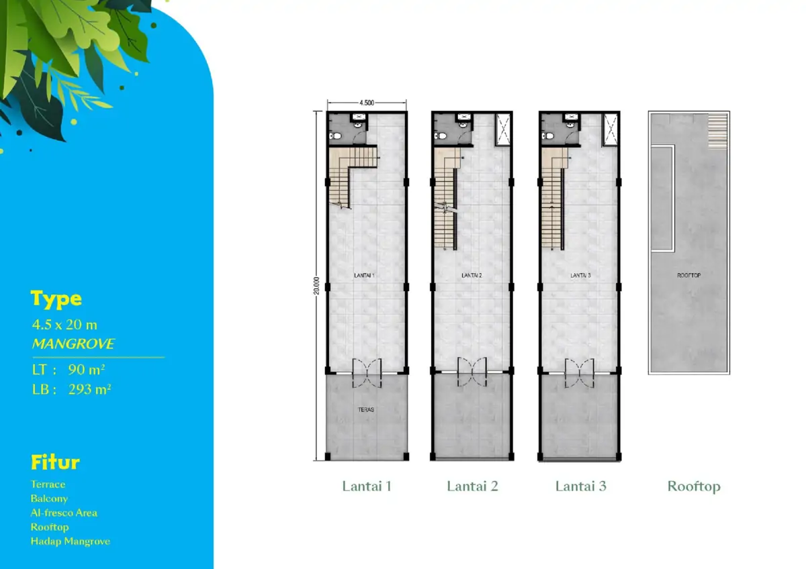

### Tipe 6x20
Pilihan rukan River Safari tipe 6x20 meter memiliki 3 lantai bangunan dengan fasad menghadap ke mangrove PIK. Fitur ruko dengan terrace, area al-fresco yang bersifat opsional oleh pemilik, balkoni dan memiliki rooftop.
- Luas tanah: 120 m2
- Luas bangunan: 390 m2.

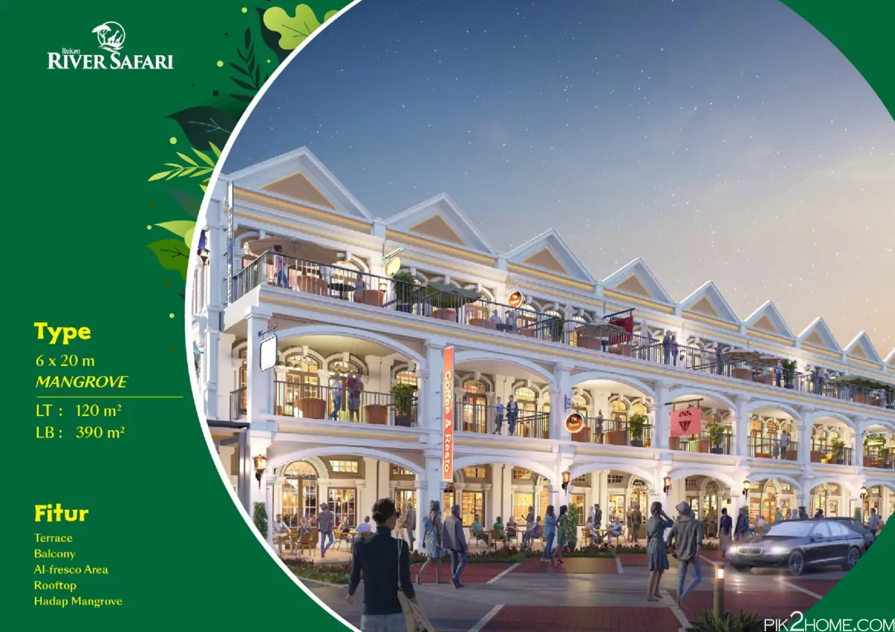
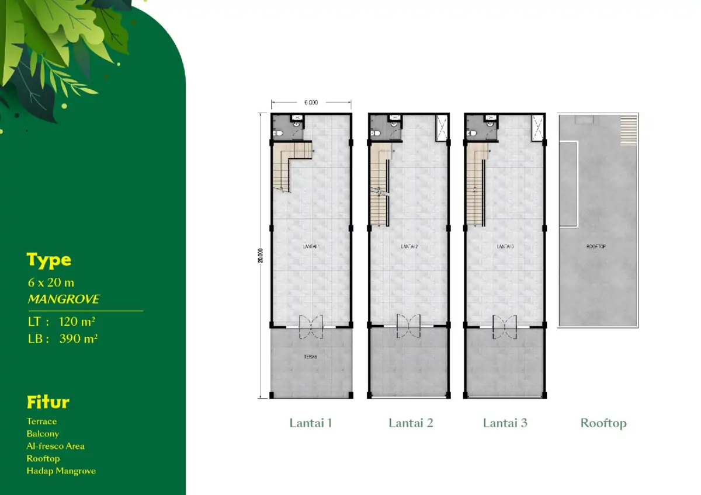

### Lokasi Rukan River Safari
Dimana lokasi Rukan River Safari ? Berada di kawasan PIK 2 Jakarta, lokasi rukan River Safari berada di jalan boulevard Pasir Putih, bersebelahan dengan mangrove PIK dan wahana terbaru PIK 2 River Safari.

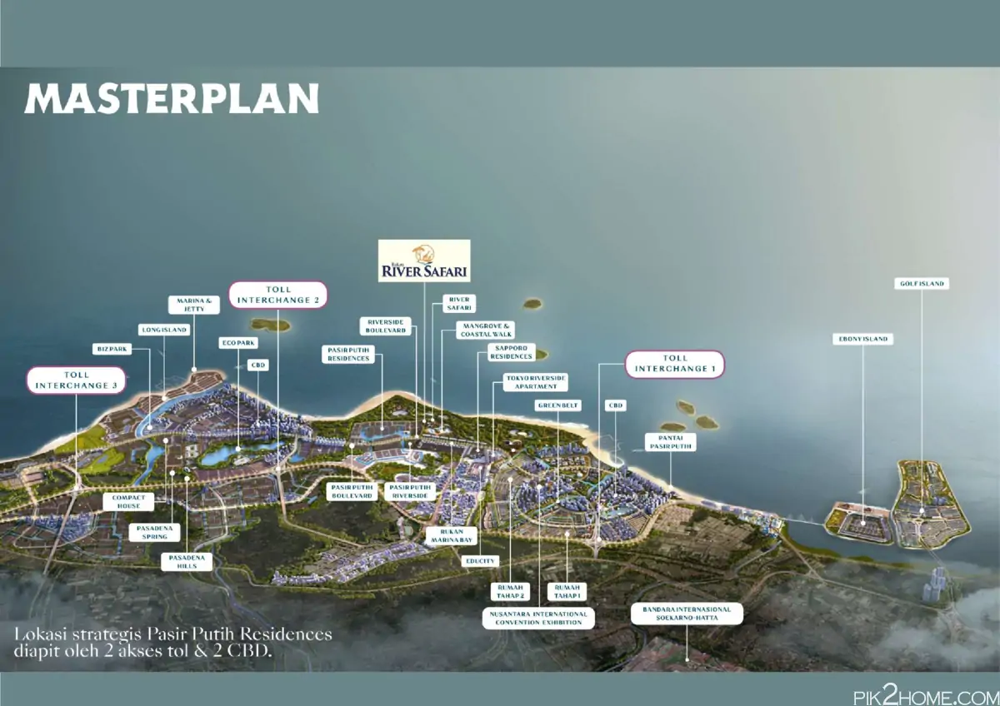

Pada gambar **master plan terbaru PIK 2** diatas, terlihat lebih jelas, lokasi rukan River Safari yang berdekatan juga dengan [perumahan Sapporro Residences](https://pik2home.com/proyek/sapporo-residences-pik-2/) dan **Tokyo Riverside apartment**.

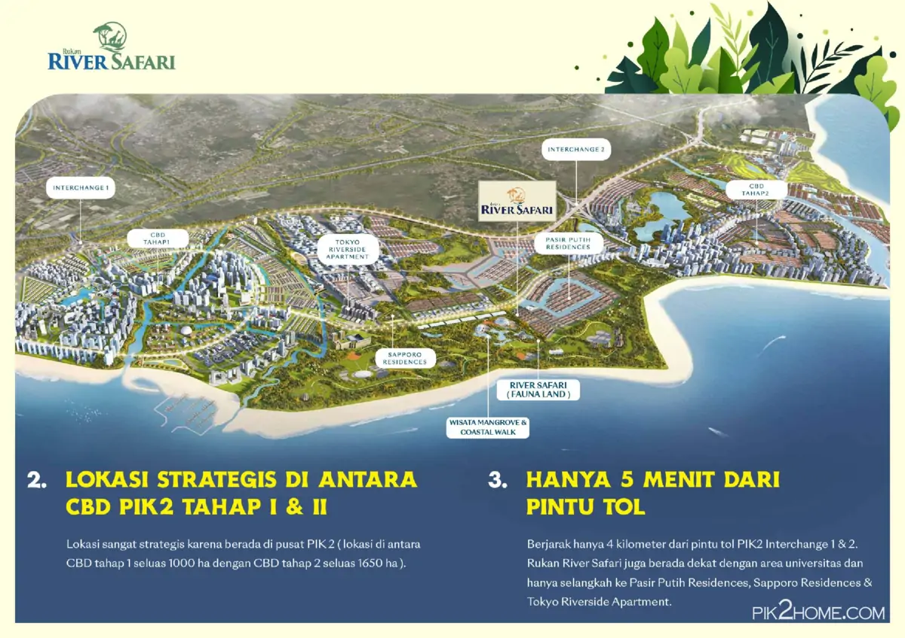

## Sales Rukan River Safari PIK 2
Jika anda sedang mencari rukan / ruko baru di PIK 2 yang baru saja launching perdana 2023, dapatkan harga jual rukan PIK 2 perdana yang dikembangkan oleh developer ternama, langsung saja hubungi sales rukan PIK 2 yang bisa anda percaya dan selalu siap membantu memberikan penjelasan mengenai produk rukan River Safari. 

Untuk info price list harga rukan River Safari PIK 2 juga dapat anda tanyakan langsung juga karena dapat berubah sewaktu-waktu oleh pengembang.

