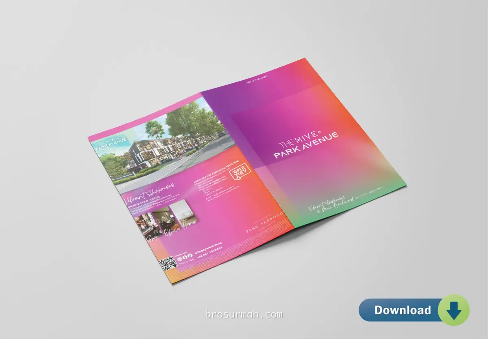
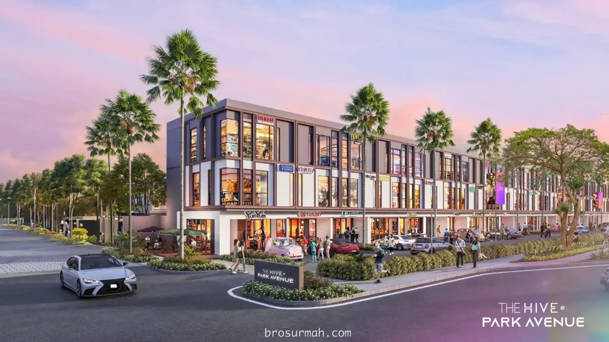
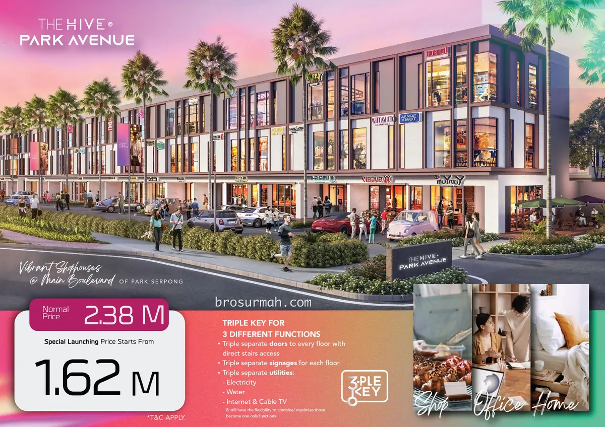
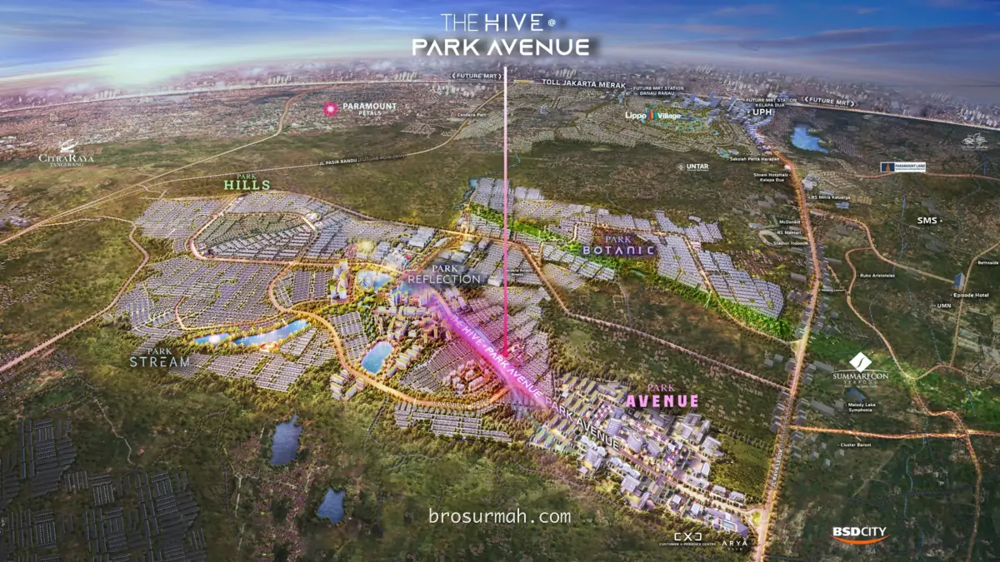
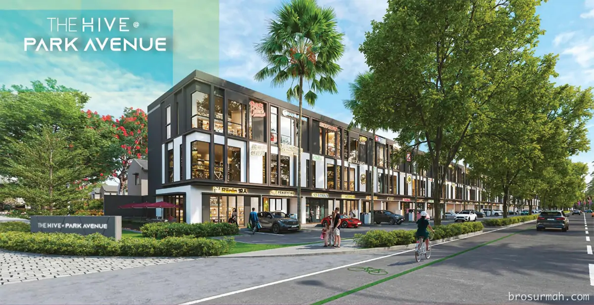
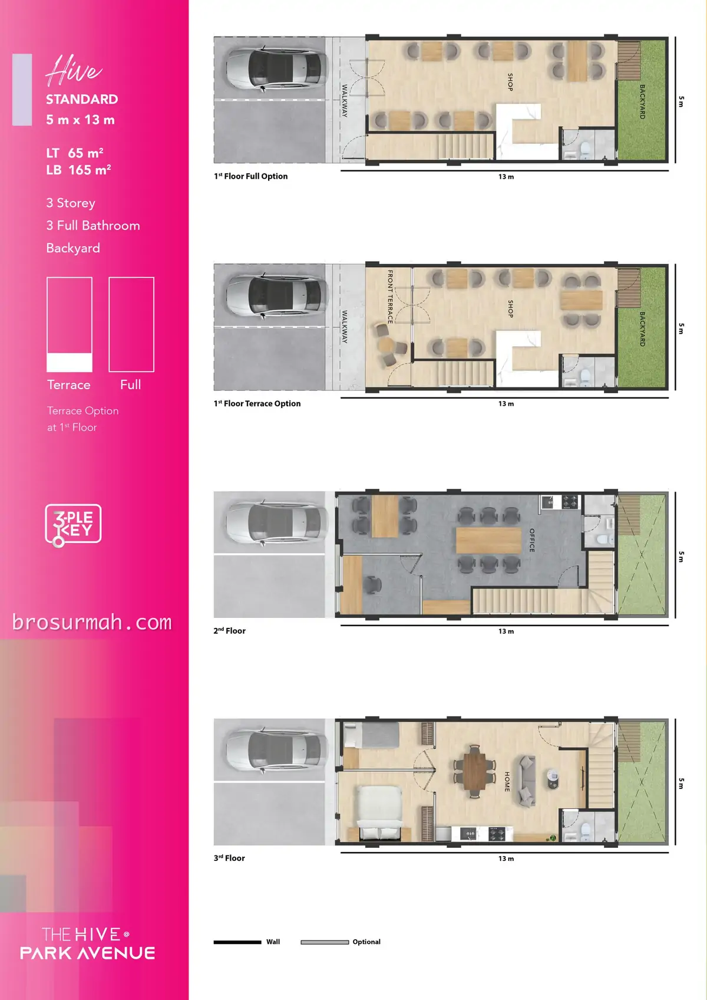
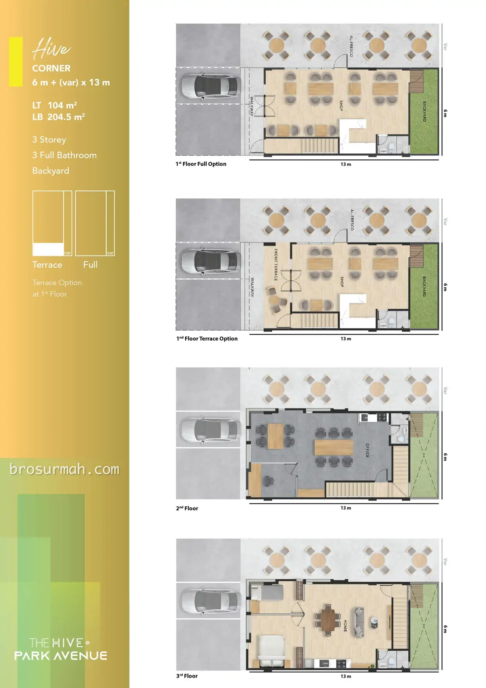

## Download Brosur Ruko Park Serpong The Hive @ Park Avenue
**Download brosur ruko Park Serpong The Hive @ Park Avenue** launching perdana 2023 oleh pengembang [Lippo Group](https://lippogroup.com/#?). Harga jual ruko The Hive Park Serpong saat launching perdana adalah mulai Rp.1,62 milyaran*.

## Ruko Park Serpong The Hive
**Ruko Park Serpong The Hive** adalah ruko terbaru pertama yang dipasarkan oleh pengembang *Lippo*. Berada di main boulevard Park Serpong district Park Avenue, ruko The Hive memiliki lokasi yang strategis dekat dengan Gading Serpong dan juga BSD City. 

Ruko Park Serpong The Hive dijual perdana dengan harga diskon mulai Rp. 1,62 milyaran*, sudah dapat 3 lantai ruko dengan konsep **triple key**. 
- 3 pintu dan akses tangga terpisah per masing-masing lantai, sehingga bisa disewakan ke beberapa tenant yang berbeda.
- 3 signaee board per lantai.
- 3 utilitas bill per lantai untuk air, listrik, internet, tv kabel.

### Lokasi Ruko The Hive Park Serpong
Dimana lokasi ruko The Hive ? Pada gambar master plan terbaru Park Serpong, terlihat jelas lokasi ruko Park Serpong The Hive yang berada di tengah-tengah kawasan dan disepanjang boulevard Park Avenue District Park Serpong. 

## Dijual Ruko CitraGarden Serpong La-Vallee Boulevard
Ruko baru CitraGarden Serpong La-Vallee Boulevard dijual perdana dengan beberapa pilihan tipe ruko sebagai berikut:

### Tipe Hive Standard
TIpe standard lebar 5 dan panjang 13 meter ruko The Hive Park Serpong dengan spesifikasi:
- Bangunan 3 lantai
- Luas tanah 65 m2
- Luas bangunan 165 m2
- Halaman belakang
- Opsi lantai 1 dengan terrace

### Tipe Hive Sudut
TIpe standard lebar 6+VAR dan panjang 13 meter ruko The Hive Park Serpong dengan spesifikasi:
- Bangunan 3 lantai
- Luas tanah 104 m2
- Luas bangunan 204,5 m2
- Halaman belakang
- Terdapat space di samping ruko
- Opsi lantai 1 dengan terrace.

## Sales Ruko Park Serpong
Jika anda sedang mencari ruko baru di dekat Gading Serpong, Tangerang launching perdana 2023, hubungi [sales ruko Park Serpong](https://park-serpong.id/hubungi-kami/) sekarang juga untuk memesan NUP bagi ikut serta dalam pengundian ruko The Hive yang dijadwalkan lauching perdana bulan Desember 2023.

Untuk info price list harga ruko Park Serpong The Hive juga dapat anda tanyakan langsung juga karena dapat berubah sewaktu-waktu oleh pengembang.



