## Download Brosur Ruko Vanya Avenue BSD
**Download brosur ruko Vanya Avenue BSD** launching perdana 2024 oleh pengembang [BSD City](https://bsdcity.com/#?) sebanyak 12 ruko saja. Harga jual ruko Vanya Avenue BSD saat launching perdana adalah mulai Rp.2,4 milyaran*.

[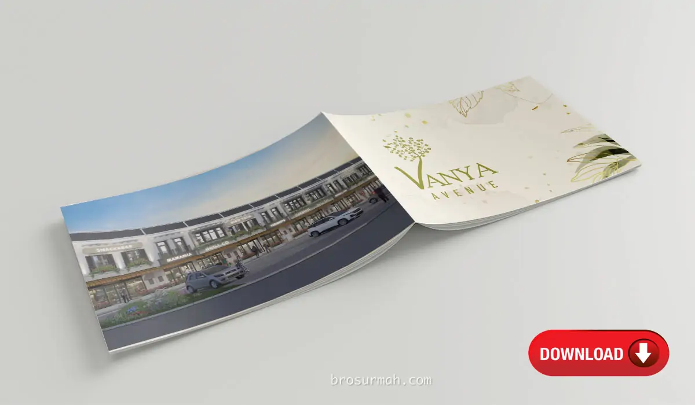](https://drive.google.com/drive/folders/17mwTjyMp3FGZiRJW3J5B8H4ZwSY5Fbey?usp=drive_link#?)

## Ruko Vanya Avenue BSD
**Ruko Vanya Avenue BSD** adalah ruko terbaru BSD City launching perdana 2024. Berada di kawasan perumahan danau Vanya Park BSD, [ruko Vanya Avenue dijual](https://investproperti.com/vanya-avenue-ruko-baru-vanya-park-bsd-city/) dengan unit sangat terbatas, yaitu 12 unit ruko saja memiliki lokasi hadap jalan langsung.

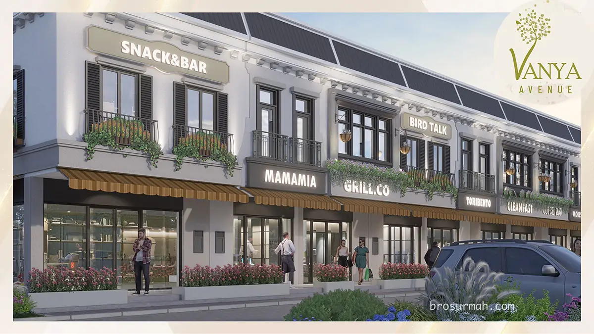
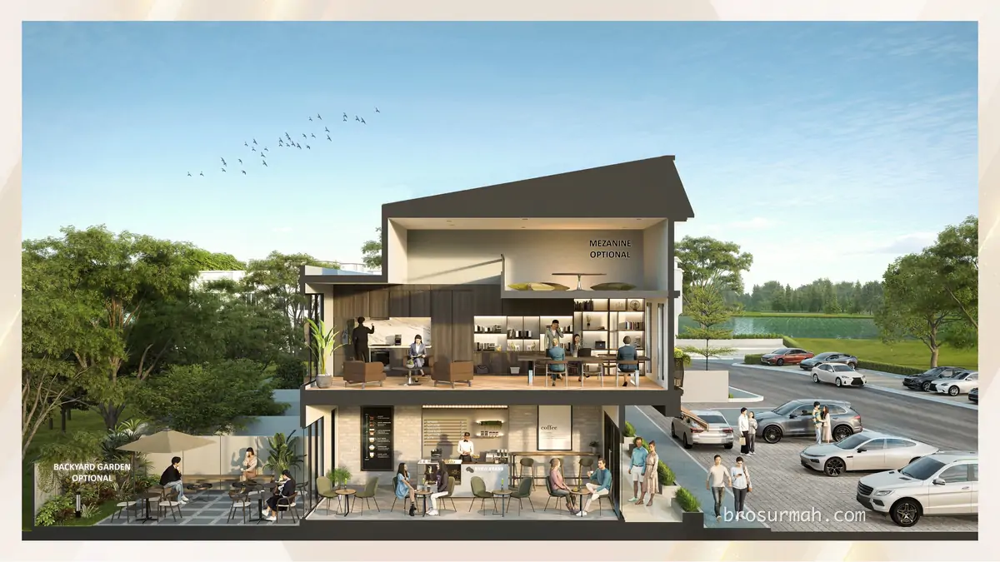

Posisi ruko Vanya Avenue berdekatan dengan danau Vanya Park yang indah seluas 8 hektar.

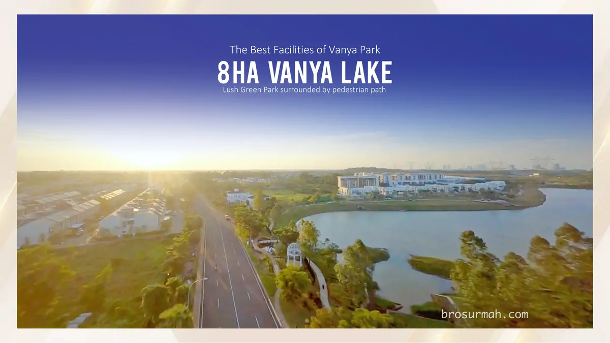

### Lokasi Ruko Vanya Avenue BSD
Pada gambar master plan Vanya Park BSD terbaru di tahun 2024, dapat dilihat lokasi ruko Vanya Avenue yang berdekatan dengan gerbang utama masuk kawasan Vanya Park.

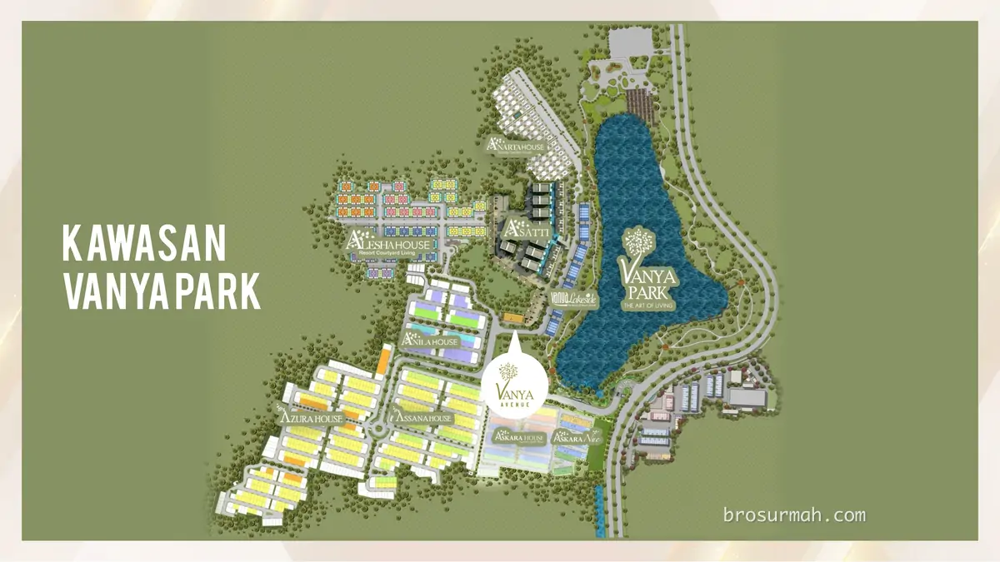

Potensi pengunjung ruko Vanya Avenue adalah besar jika melihat sebanyak > 2.200 unit hunian dalam kawasan Vanya Park BSD sendiri saja. Belum ditambah dengan hunian perumahan, apartemen dan perkantoran sekeliling Vanya Park BSD.
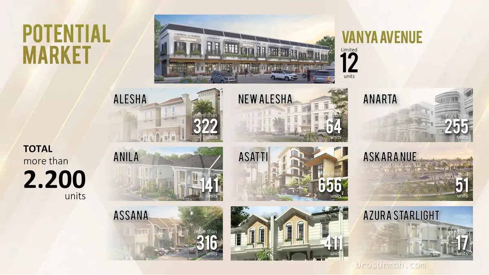

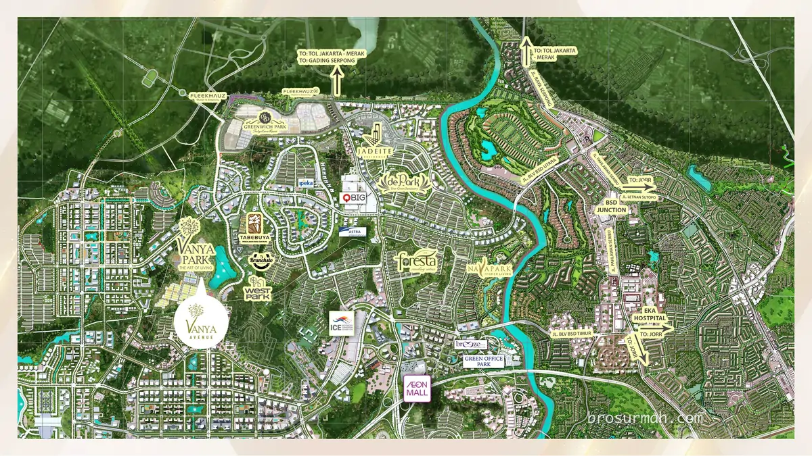

## Dijual Ruko Vanya Avenue bSD
Ruko baru Vanya Avenue BSD dijual dengan 12 unit dan 3 pilihan tipe ruko.

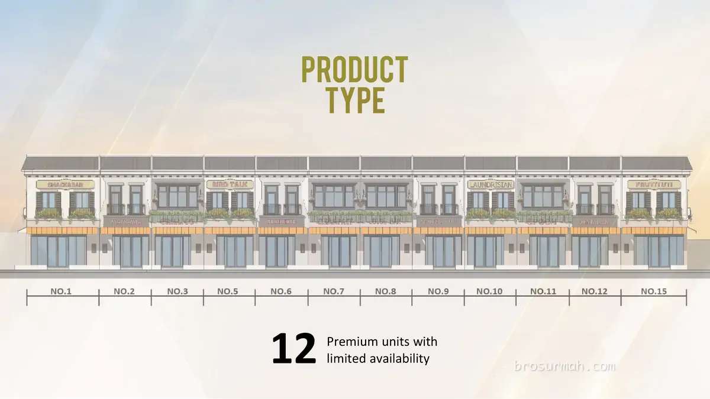
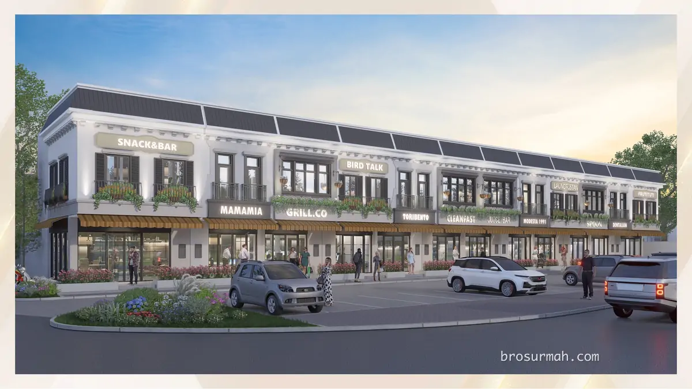

### Tipe T80
- 2 lantai
- Dimensi 4x17 meter
- Ada halaman belakang
- Pilihan opsi lantai mezzanine
- Luas tanah 68 m2
- Luas bangunan 80 m

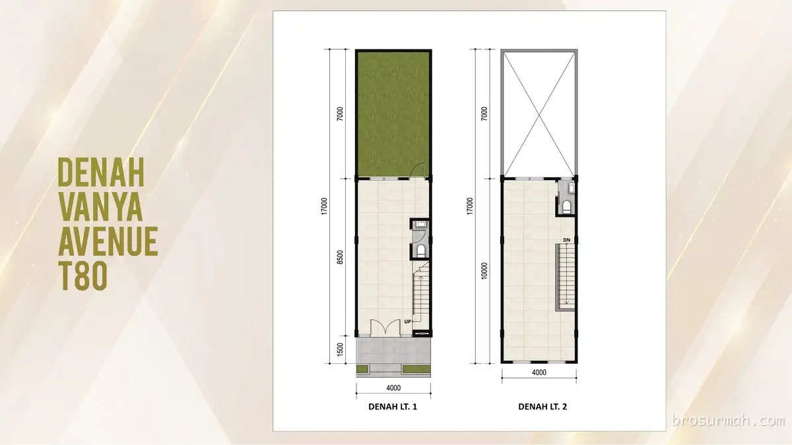

### Tipe T101
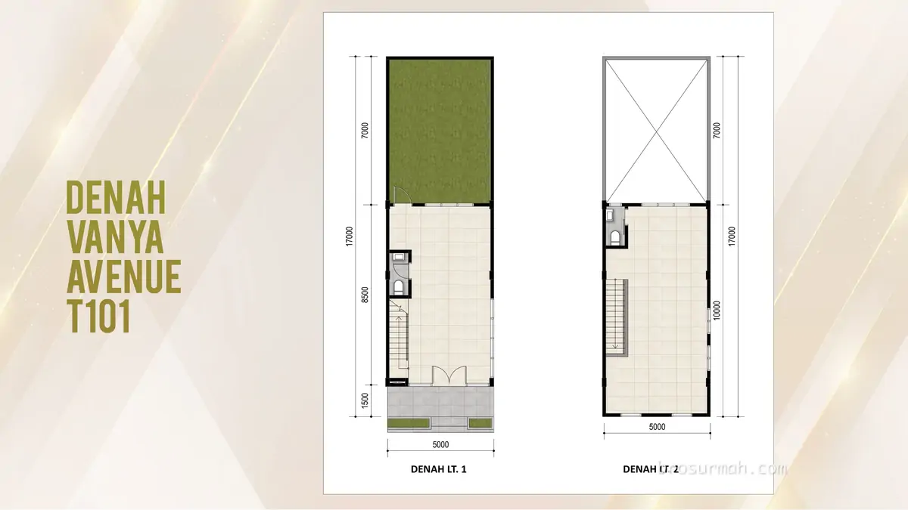
- 2 lantai
- Dimensi 5x17 meter
- Ada halaman belakang
- Pilihan opsi lantai mezzanine

### Tipe T108
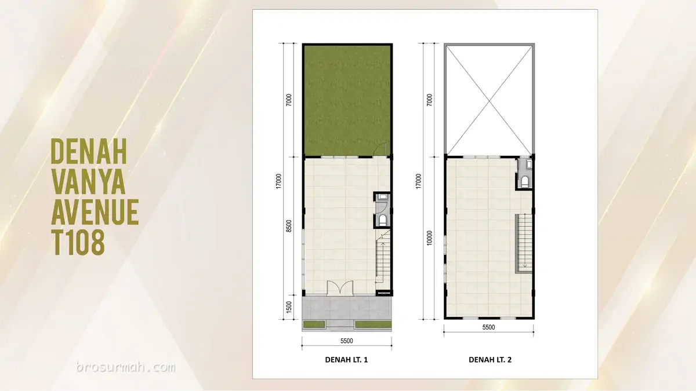
- 2 lantai
- Dimensi 5,5x17 meter
- Ada halaman belakang
- Pilihan opsi lantai mezzanine

## Siteplan Ruko Vanya Avenue BSD
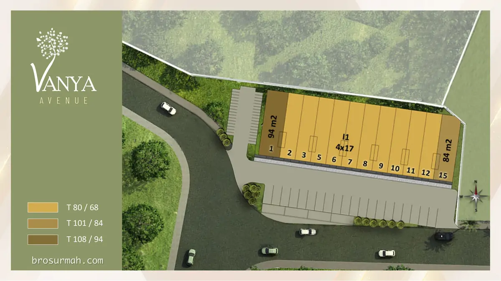

## Sales Ruko Vanya Avenue BSD
Jika anda sedang mencari ruko baru di BSD City, Tangerang launching perdana 2024, hubungi [sales ruko Vanya Avenue BSD](https://bsdcityhome.com/project/ruko-vanya-avenue-bsd/#?) sekarang juga untuk memesan NUP bagi ikut serta dalam pengundian dalam waktu dekat ini.

Untuk info price list harga ruko Vanya Avenue juga dapat anda tanyakan langsung juga karena dapat berubah sewaktu-waktu oleh pengembang.



