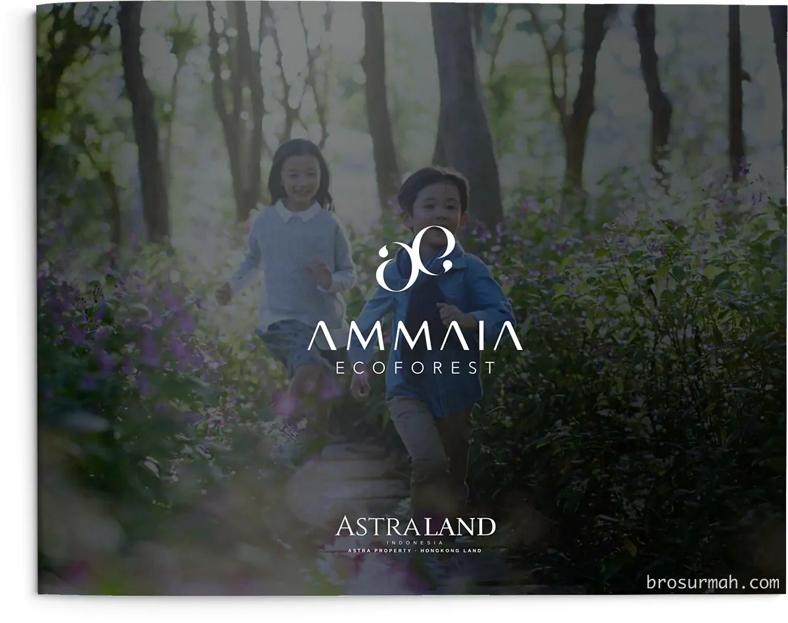
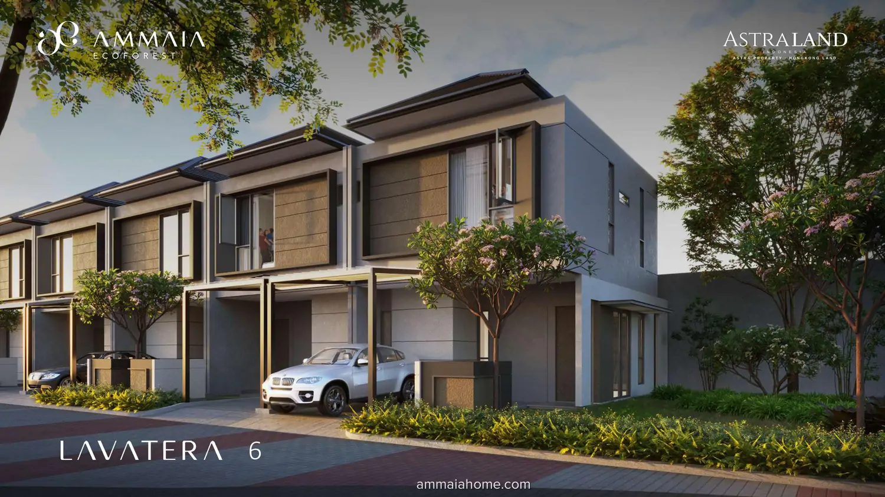
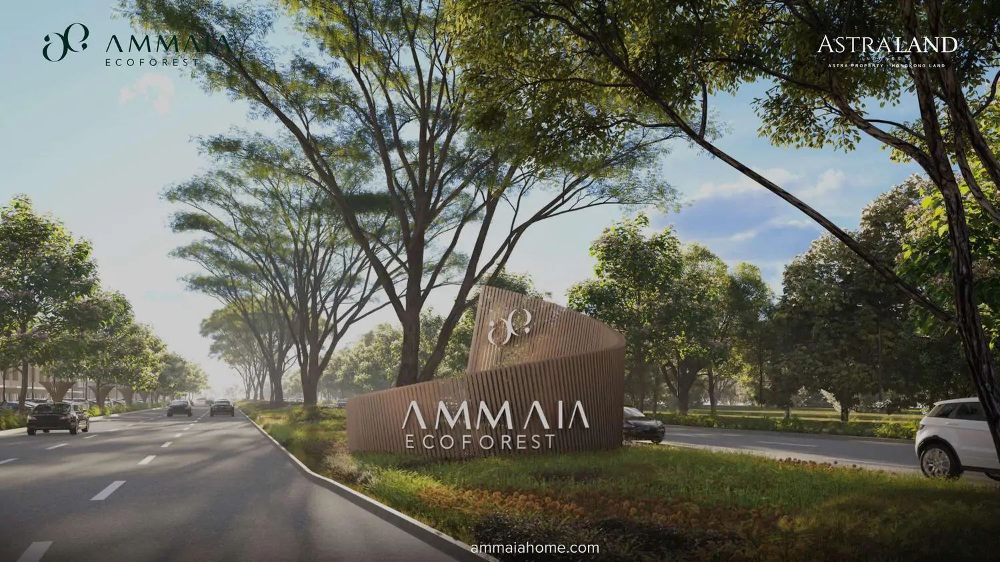
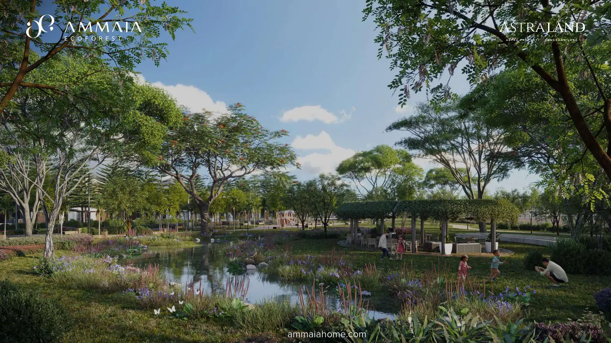
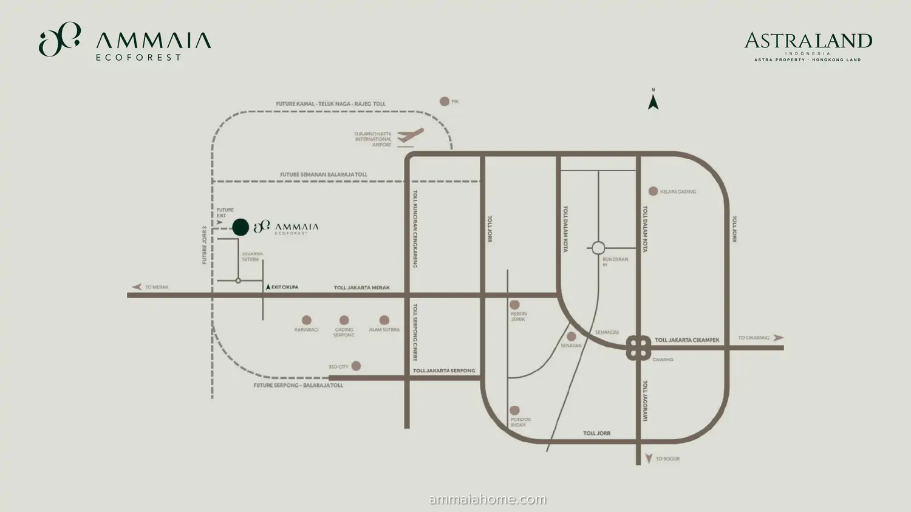

## Download Brosur Rumah Lavatera Ammaia Ecoforest
**Download brosur rumah Ammaia Ecoforest Cikupa** cluster **Lavatera** yang telah dirilis perdana oleh pengembang secara resmi pada bulan Oktober-2023.

## Cluster Lavatera Ammaia Ecoforest Cikupa
**Lavatera** adalah cluster pertama perumahan baru Astra Land di Cikupa Tangerang dengan nama [Ammaia Ecoforest](https://ammaiahome.com/). Dikembangkan oleh [Astra Land](https://www.astra.co.id/Business/Property/Property/PT-Astra-Land-Indonesia#?), **Ammaia Ecoforest** akan dibangun kurang lebih 2.000 unit rumah pada total lahan seluas 50 hektar. 

**PT Astra Land Indonesia** merupakan perusahaan joint venture antara **Astra Property** dan [Hongkong Land](https://www.hkland.com/en#?), yang telah sukses mengembangkan kawasan mixed-use premium di BSD City, **Navapark**.

**Cluster Lavatera** menawarkan 3 pilihan tipe rumah, dari lebar 6 meter, 7 sehingga 8 meter. Desain rumah Ammaia Ecoforest cluster Lavatera adalah modern minimalis dan kekinian. Luas bangunan rumah mulai dari 84 m2, 110 m2 dan 201 m2.

Saat launching perdana, [rumah Ammaia Ecoforest Cikupa dijual](https://investproperti.com/ammaia-ecoforest-perumahan-baru-astraland-di-cikupa-tangerang/) mulai daripada harga rumah Rp.1,6 milyaran* setelah diskon s/d Rp. 4,4 milyaran*. Untuk harga terbaru, langsung saja hubungi [sales rumah Ammaia Ecoforest Cikupa](https://ammaiahome.com/sales-rumah-ammaia-ecoforest/) ya, biar lebih pasti.

Pada gambar ilustrasi diatas, **gerbang iconic Ammaia Ecoforest** menyambut kedatangan penghuni atau pengunjung, dengan sisi kiri, kanan dan tengah jalan yang rimbun ditanami pepohonan yang rindang. 

**Ammaia Ecoforest Cikupa** telah mendapatkan Sertifikasi **Greenship Neighborhood** peringkat Gold dari *Green Building Council Indonesia (GBCI)*, menurut sumber [Media Indonesia](https://mediaindonesia.com/ekonomi/620384/ammaia-ecoforest-besutan-astra-land-luncurkan-cluster-lavatera#?). Kawasan lingkungan yang hijau, dengan forest belt seluas 5,4 hektar, pedestrian / jogging track tersedia dalam area kawasan yang terhubung.

### Lokasi Ammaia Ecoforest Astra Land
Dimana lokasi Ammaia Ecoforest yang dikembangkan oleh **Astra Land** ? Berada di kawasan Suvarna Sutera, Cikupa, Tangerang, lokasi Ammaia Ecoforest berdekatan dengan Ruko Terrace 8 dan 9, Sekolah Santa Laurensia, Pasar Modern, tempat ibadah, supermarket. 

Menuju ke Ammaia Ecoforest dapat ditempuh melalui tol Jakarta - Merak keluar tol Cikupa menuju ke Suvarna Sutera. Lokasi Ammaia juga dekat dengan future JORR 3 Semanan - Balaraja dan Kamal - Telaga Naga - Rajeg. 

Menuju ke Lippo Karawaci hanya 15 menit, Gading Serpong 20 menit dan tol Cikupa 10 menit saja.

## Sales Rumah Ammaia Ecoforest Cikupa
Jika anda sedang mencari rumah baru di Cikupa, Tangerang baru saja launching harga jual rumah perdana yang dikembangkan oleh developer ternama, silakan hubungi langsung sales rumah Ammaia Ecoforest yang bisa anda percaya dan selalu siap membantu memberikan penjelasan mengenai produk rumah Lavatera. 

Untuk info price list harga rumah Ammaia Ecoforest cluster Lavatera juga dapat anda tanyakan langsung juga karena dapat berubah sewaktu-waktu oleh pengembang.



