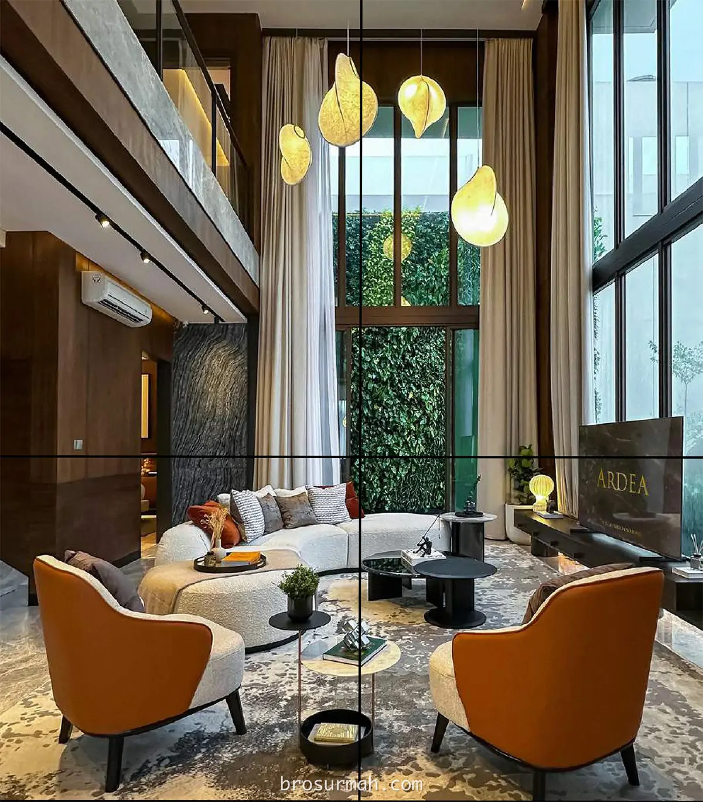

## Download Brosur Rumah Ardea Summarecon Serpong
Download **brosur rumah Ardea Summarecon Serpong** yang telah dirilis secara resmi oleh pengembang [Summarecon](https://alam-sutera.com#?). Rumah Ardea adalah rumah mewah baru di Summarecon Serpong yang berlokasikan di kawasan cluster Heron The Spring Gading Serpong.

## Mengenai Cluster Ardea Summarecon Serpong

**Cluster Ardea Summarecon Serpong** adalah produk hunian rumah mewah terbaru di Gading Serpong, Tangerang oleh pengembang terpercaya dan ternama [Summarecon Serpong](https://www.summareconserpong.com/#?). Menawarkan gaya hidup kelas atas, **rumah Ardea** dijual perdana pada harga rumah mulai dari Rp. 6,6 milyaran* saat launching perdana.

**Rumah Ardea** memiliki desain rumah modern yang sempurna, dimana area ruangan yang luas disetiap lantai, plafon volume ganda, dilengkapi pavillion pribadi dan spesifikasi dan fitur rumah sangat premium seperti smart home, EV charging ready, lift, automatic garage door, USB power charging, indoor/outdoor smart cctv.

Ditambah dengan fasilitas cluster yang modern dan ekslusive seperti jacuzzi, club house dengan full aircon, private family sauna, kolam renang, nature walkway, children playground dan aqua-zen garden memberikan kenyamanan hunian maksimum di Gading Serpong, Tangerang.

### Tipe Rumah Ardea Summarecon Serpong

Rumah mewah terbaru [Summarecon Serpong cluster Ardea](https://investproperti.com/ardea-rumah-mewah-summarecon-serpong-heron-the-spring/) menawarkan 4 pilihan tipe rumah bagi konsumen.

### Tipe Ardea A & B

Rumah premium Ardea Summarecon Serpong **tipe A** memiliki spesifikasi:
- 3 lantai bangunan
- Luas tanah 209 m2
- Luas bangunan 359 m2
- 5+1 kamar tidur
- 5+1 kamar mandi
- 3 carport.
- Harga jual Rp. 9,3 milyaran*.

Rumah mewah Ardea Summarecon Serpong **tipe B** memiliki spesifikasi:
- 3 lantai bangunan
- Luas tanah 176 m2
- Luas bangunan 338 m2
- 5+1 kamar tidur
- 5+1 kamar mandi
- 3 carport.
- Harga jual Rp. 8,4 milyaran*.

### Tipe Ardea C & D

Rumah premium Ardea Summarecon Serpong **tipe C** memiliki spesifikasi:
- 3 lantai bangunan
- Luas tanah 171 m2
- Luas bangunan 248 m2
- 5+1 kamar tidur
- 5+1 kamar mandi
- 2 carport.
- Harga jual Rp. 7,2 milyaran*.

Rumah mewah Ardea Summarecon Serpong **tipe D** memiliki spesifikasi:
- 3 lantai bangunan
- Luas tanah 144 m2
- Luas bangunan 248 m2
- 5+1 kamar tidur
- 5+1 kamar mandi
- 2 carport.
- Harga jual Rp. 6,26 milyaran*.

### Siteplan Cluster Ardea
Penjualan tahap pertama rumah Ardea Summarecon Serpong dapat dilihat pada gambar siteplan dibawah. Pilih posisi unit rumah idaman anda di The Springs Gading Serpong.

### Dimana Lokasi Cluster Ardea
Berada di kawasan perumahan The Springs Summarecon Serpong, cluster Ardea menempati lokasi dekat dengan cluster Heron

## Sales Rumah Ardea Gading Serpong
Anda berminat untuk membeli rumah Ardea Summarecon Serpong atau ingin bertanya lebih lanjut mengenai produk hunian rumah mewah baru di Gading Serpong launching perdana tahun 2024, dapat menghubungi sales rumah Ardea yang terpercaya dan selalu siap membantu anda.

Untuk info price list harga rumah Ardea Summarecon Serpong juga dapat anda tanyakan langsung juga karena dapat berubah sewaktu-waktu oleh pengembang.



