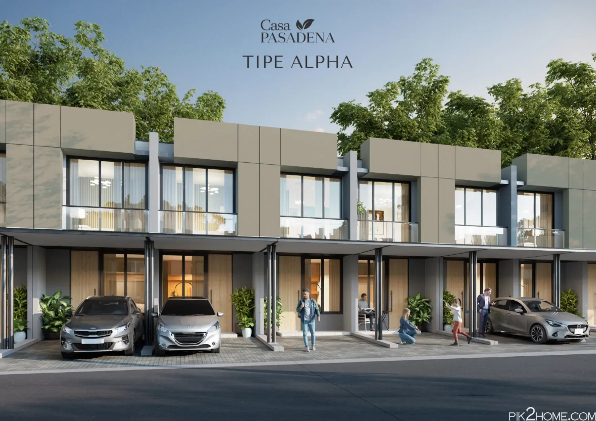
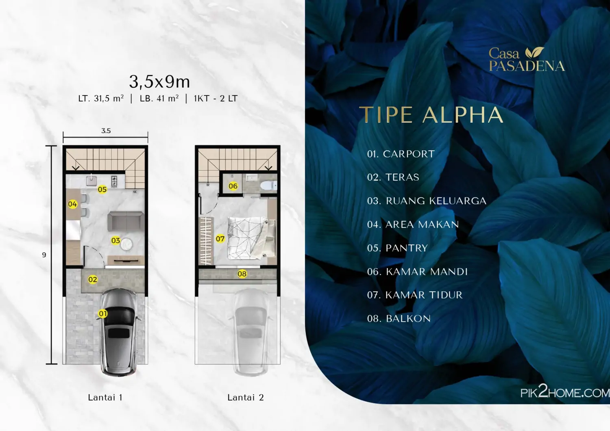
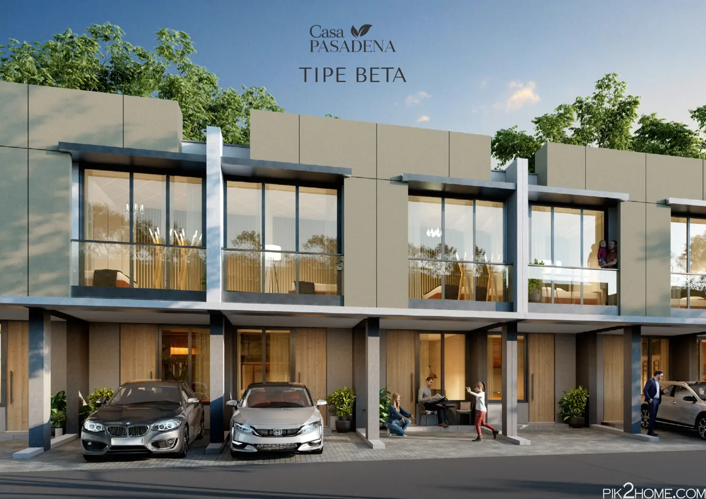
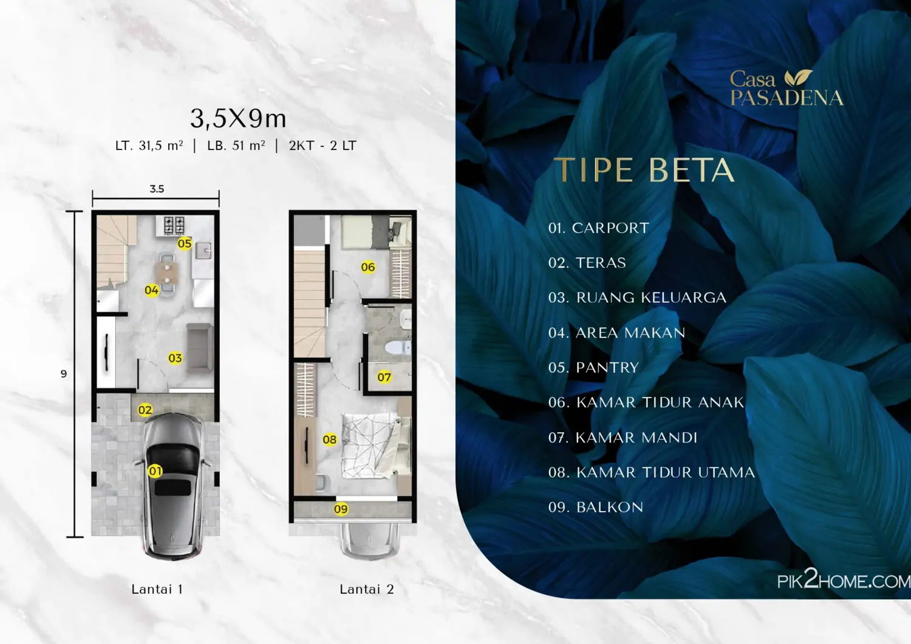
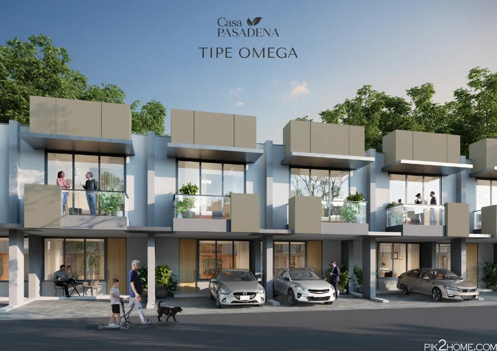
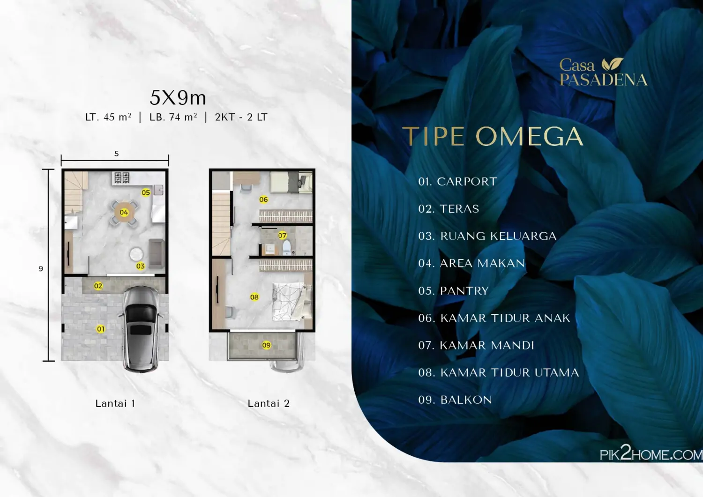
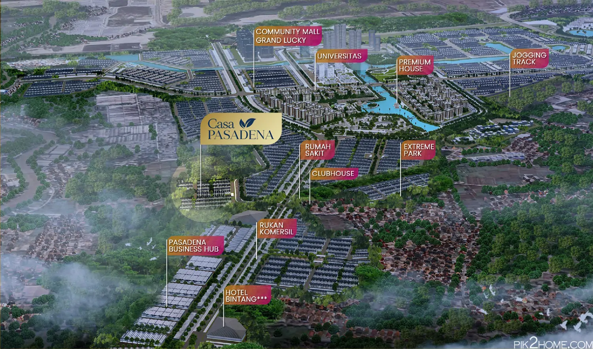
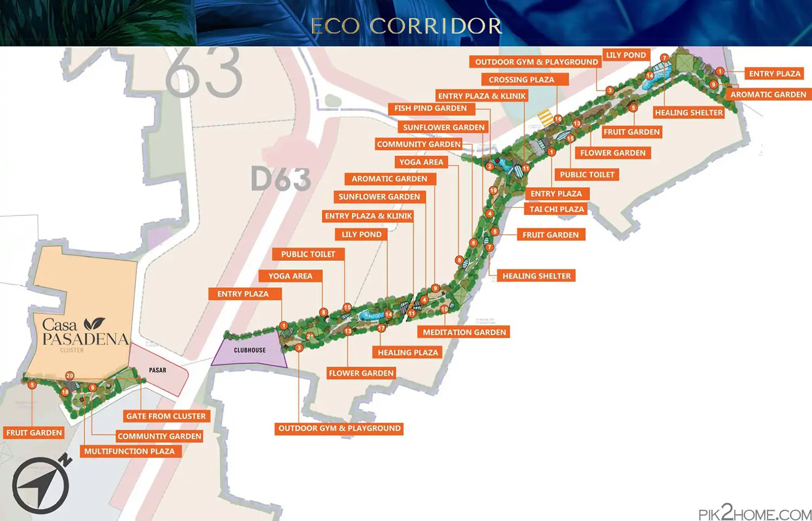

## Download Brosur Rumah Casa Pasadena PIK 2
**Download brosur rumah Casa Pasadena PIK 2 Jakarta**  yang telah dirilis perdana oleh pengembang secara resmi pada bulan Oktober-2023. [Rumah PIK 2 Casa Pasadena](https://pik2home.com/proyek/casa-pasadena-pik-2-jakarta/) sudah memiliki 2 lantai dan harga jual rumah daripada Rp. 880 jutaan*. Sudah dapat rumah dengan harga apartemen. Lebih baik bukan?

## Cluster Casa Pasadena PIK 2
**Casa Pasadena** adalah cluster terbaru PIK 2 Jakarta yang menawarkan 3 pilihan tipe rumah yaitu **tipe Alpha**, **tipe Beta** dan **tipe Omega** yang terluas. Semua tipe memiliki 2 lantai bangunan. Mari kita liat satu persatu pilihan rumah Casa Pasadena PIK 2.

### Tipe Alpha

Rumah Casa Pasadena tipe alpha menawarkan bangunan 2 lantai dengan spesifikasi:
- Luas tanah: 31,5 m2
- Luas bangunan: 41 m2
- 1 kamar tidur
- 1 kamar mandi
- 1 carport
- balkoni.

### Tipe Beta

Rumah Casa Pasadena tipe Beta menawarkan bangunan 2 lantai dengan spesifikasi:
- Luas tanah: 31,5 m2
- Luas bangunan: 51 m2
- 2 kamar tidur
- 1 kamar mandi
- 1 carport
- balkoni.

### Tipe Omega

Rumah Casa Pasadena tipe Omega menawarkan bangunan 2 lantai dengan spesifikasi:
- Luas tanah: 45 m2
- Luas bangunan: 74 m2
- 2 kamar tidur
- 1 kamar mandi
- 1 carport
- balkoni.

Saat launching perdana, [rumah Casa Pasadena PIK 2 dijual](https://investproperti.com/casa-pasadena-pik-2-jakarta/) mulai daripada harga rumah Rp. 880 jutaan*. Untuk price list harga jual rumah Casa Pasadena PIK2 yang paling baru, dapat langsung hubungi [sales rumah PIK 2](https://pik2home.com/hubungi-kami/) untuk kepastiannya.

### Lokasi Casa Pasadena PIK 2
Dimana lokasi Casa Pasadena PIK2 ? Sangat strategis di kawasan PIK 2 Jakarta, Casa Pasadena dikelilingi oleh berbagai fasilitas pendukung yang sangat lengkap. Sebut saja mulai dari:
- Rukan komersial
- Hotel bintang 3
- Pasadena Business Hub
- Extreme Park
- Eco corridor seluas 10 hektar.

**Eco corridor** PIK 2 seluas 10 hektar menawarkan alam yang rindang yang dapat dicapai dengan berjalan kali saja dari Casa Pasadena. Fitur lengkap Eco corridor PIK 2 dapat dilihat pada gambar siteplan dibawah, dengan berbagai taman thematic, dan plaza.

## Sales Rumah Casa Pasadena PIK 2
Jika anda sedang mencari rumah baru di PIK 2 Jakarta yang baru saja launching perdana Oktober 2023, dapat langsung kontak **sales rumah PIK 2** yang bisa anda percaya dan selalu siap membantu memberikan penjelasan mengenai produk rumah Casa Pasadena. 

Untuk info price list harga rumah Casa Pasadena juga dapat anda tanyakan langsung juga karena dapat berubah sewaktu-waktu oleh [pengembang PIK 2](https://pik2.com/tentang#?).

