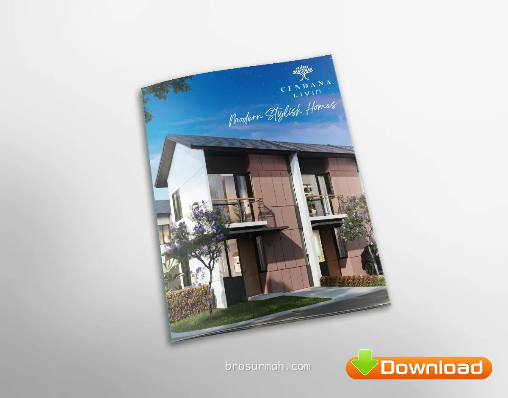
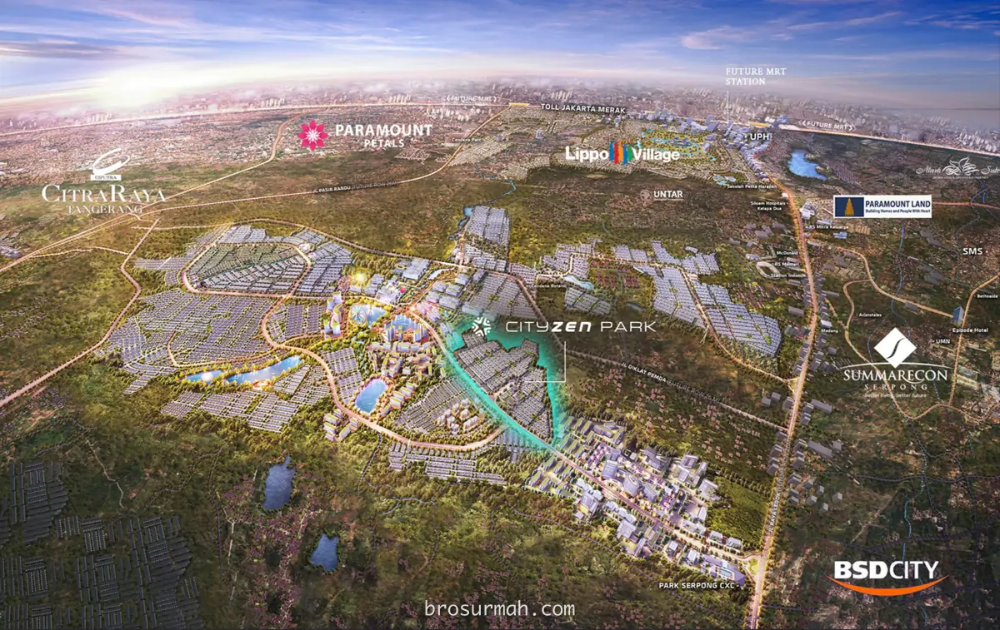
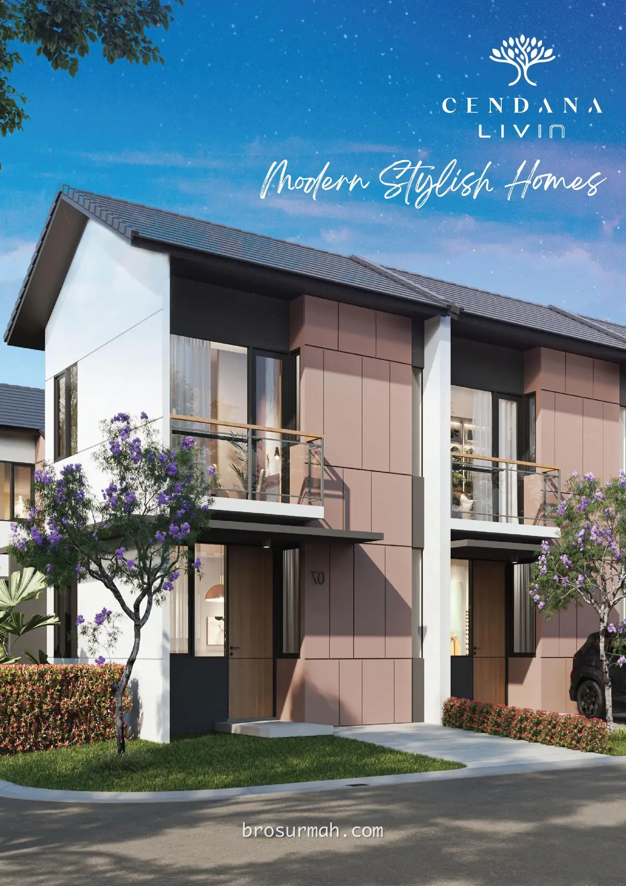
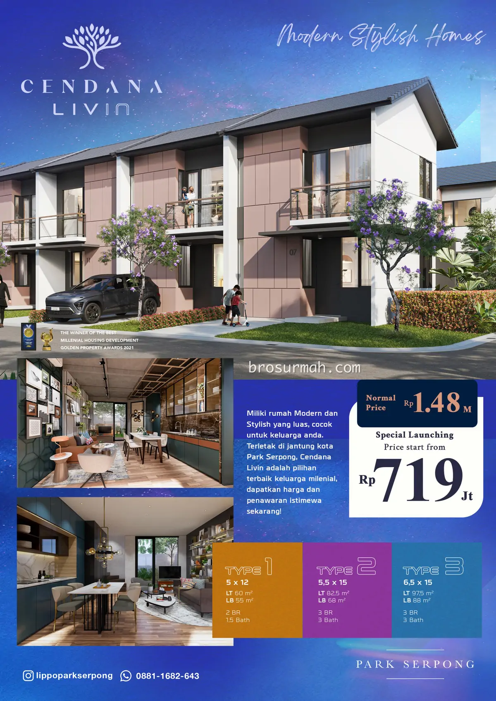
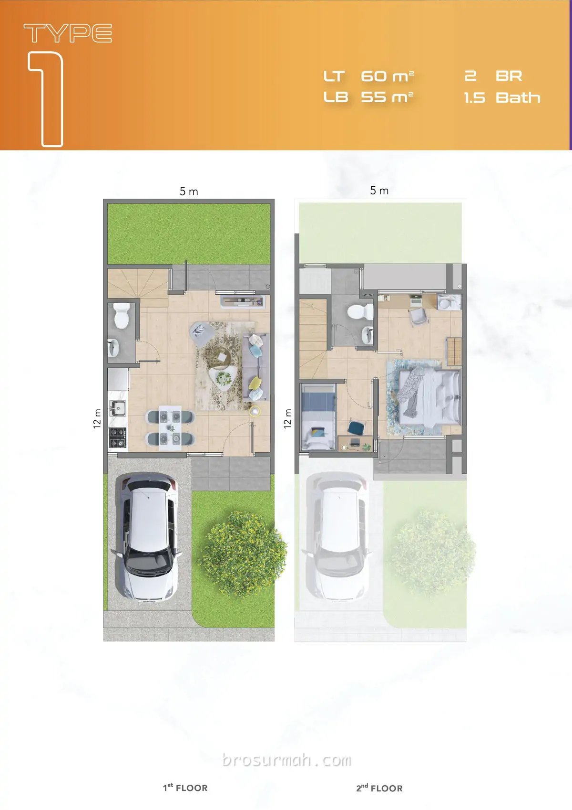
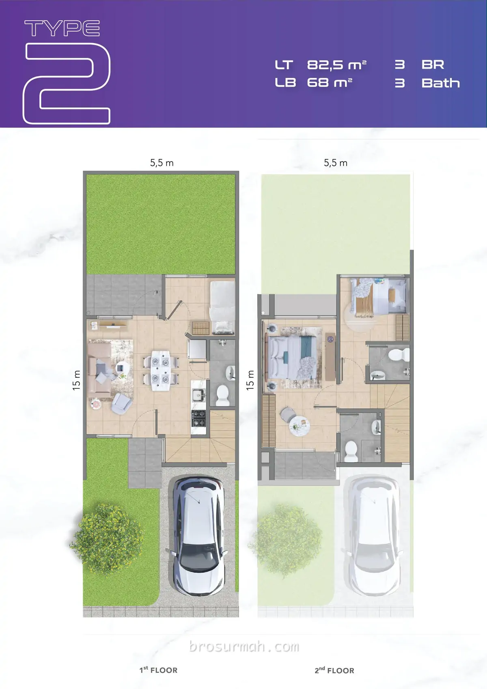
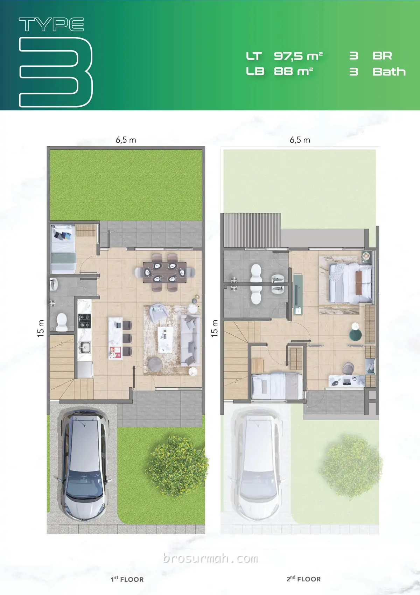

## Download Brosur Rumah Cendana Livin Park Serpong
Download **brosur rumah Cendana Livin Park Serpong** yang telah dirilis perdana oleh pengembang [Lippo Karawaci](https://www.lippokarawaci.co.id//#?) secara resmi. Launching perdana rumah Park Serpong Cendana Livin pada harga jual rumah daripada Rp. 719 jutaan* (harga promo*).

## Mengenai Park Serpong
**Park Serpong** adalah proyek mixed-use terbaru **PT Lippo Karawaci Tbk.* di kawasan Legok, Tangerang pada lahan seluas 400 hektar. Melihat gambar lokasi Park Serpong, dapat dilihat posisi hunian baru Lippo di Legok adalah sangat strategis dimana berada tepat di tengah kota mandiri Gading Serpong, BSD City, Citra Raya, [Paramount Petals](https://paramount-petal.com) dan Lippo Village Karawaci.

Dari Gading Serpong, menuju ke [Park Serpong](https://investproperti.com/park-serpong-perumahan-baru-lippo-rp-400-jutaan/) dapat melewati Jln. Raya Legok, Tangerang hanya berjarak 20 menit perjalanan saja. Posisi Park Serpong berdekatan dengan perumahan Symphonia Summarecon Serpong.

## Rumah Cendana Livin Park Serpong

Pada saat launching perdana, [Park Serpong](https://park-serpong.id) merilis **rumah Cendana Livin** bersamaan dengan [rumah XYZ Livin Park Serpong](/docs/xyz-livin-park-serpong/). Rumah modern dan stylist diberikan pada rumah Cendana Livin Park Serpong.

Perbedaan utama antara ke-2 rumah Park Serpong tersebut adalah target pasar yang dituju. [Rumah Cendana Livin](https://park-serpong.id/portfolio/cendana-livin-park-serpong/) ditujukan pada mereka yang mendambakan rumah lebih luas dengan budget harga rumah diatas Rp. 800 jutaan*. Sedangkan rumah XYZ Livin cocok bagi mereka yang sedang mencari rumah baru pertama dengan budget harga rumah dibawah Rp. 500 jutaan*.

Terdapat 3 tipe rumah Cendana Livin yang dijual perdana, yaitu:

### Tipe 1
2 lantai rumah tipe 1 dengan halaman belakang, dimensi 5 x 12 meter.

Spesifikasi:
- Luas tanah 60 m2
- Luas bangunan 55 m2
- 2 kamar tidur
- 1,5 kamar mandi
- 1 carpot

### Tipe 2
2 lantai rumah Cendana Livin tipe 2 dengan halaman belakang, dimensi 5,5 x 15 meter.

Spesifikasi:
- Luas tanah 82.5 m2
- Luas bangunan 68 m2
- 3 kamar tidur
- 3 kamar mandi
- 1 carpot

### Tipe 3
2 lantai rumah Cendana Livin tipe 2 dengan halaman belakang, dimensi 6,5 x 15 meter.

Spesifikasi:
- Luas tanah 97.5 m2
- Luas bangunan 88 m2
- 3 kamar tidur
- 3 kamar mandi
- 1 carpot

## Sales Rumah Park Serpong
Anda berminat untuk membeli rumah Park Serpong atau ingin bertanya lebih lanjut mengenai produk hunian rumah baru Cendana Livin yang launching perdana di tahun 2023 ini, dapat menghubungi [sales rumah Park Serpong](https://park-serpong.id/hubungi-kami/) yang bisa anda percaya dan selalu siap membantu anda.

Untuk info price list harga rumah Cendana Livin juga dapat anda tanyakan langsung juga karena dapat berubah sewaktu-waktu oleh pengembang Lippo Karawaci.

