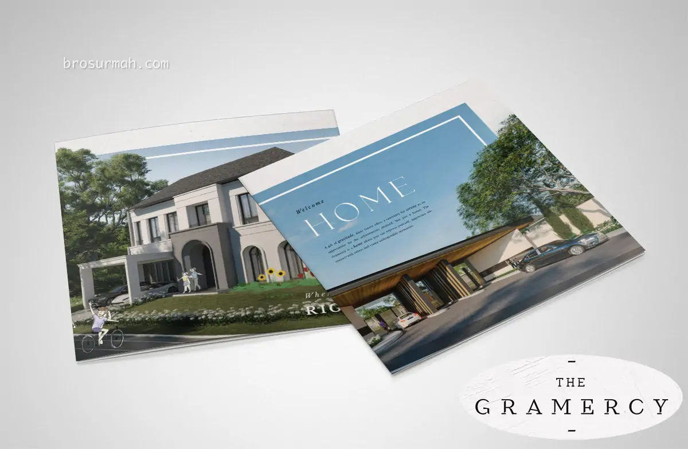
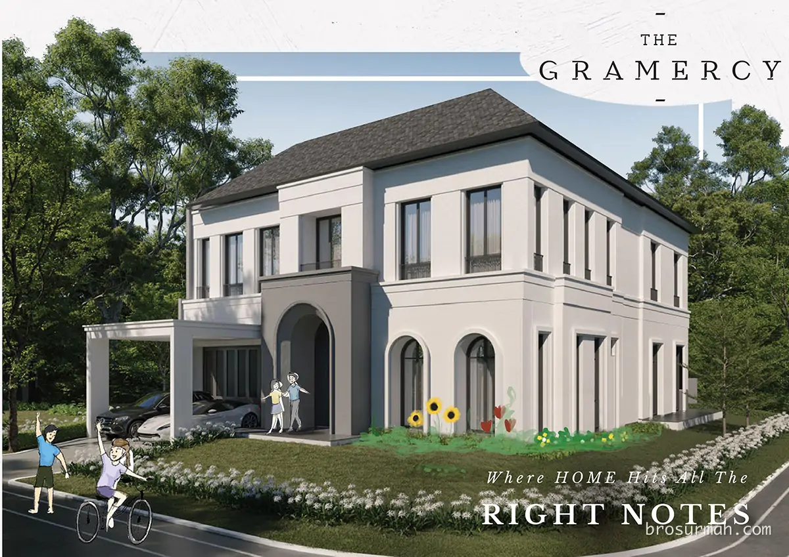
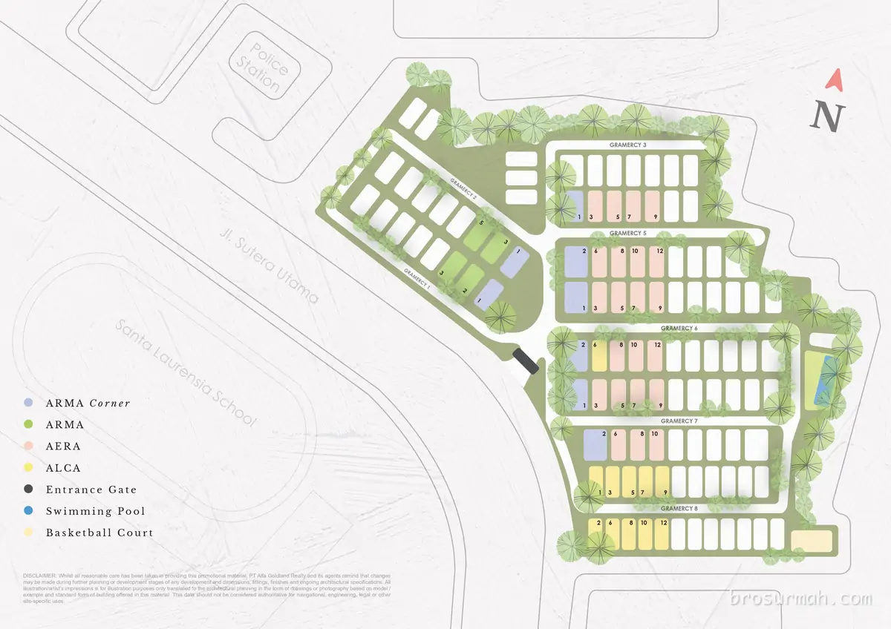
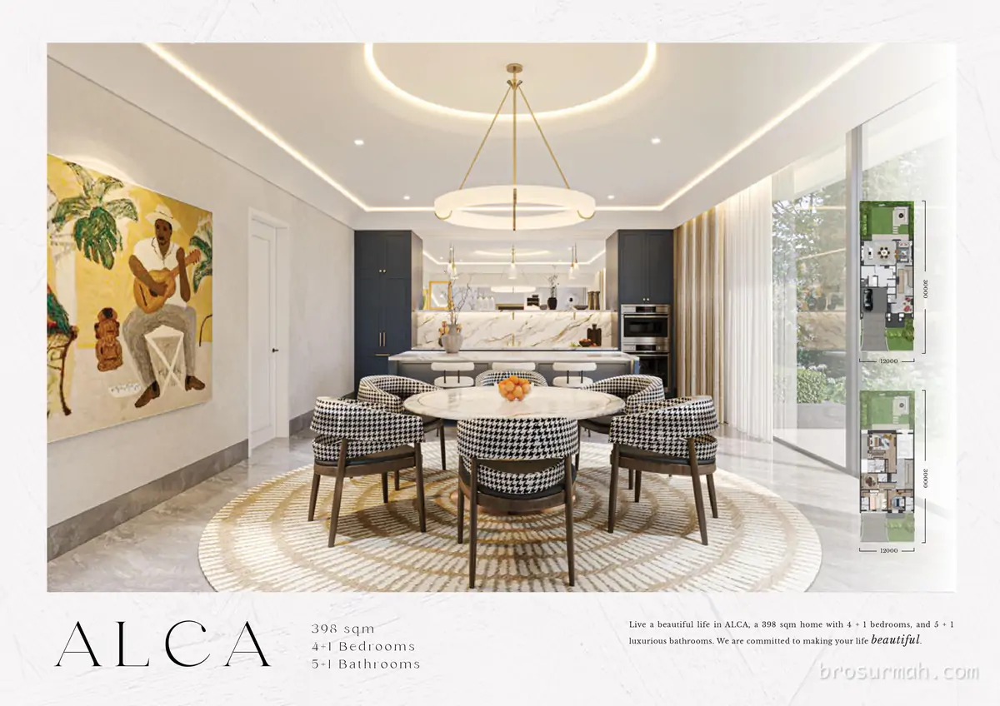
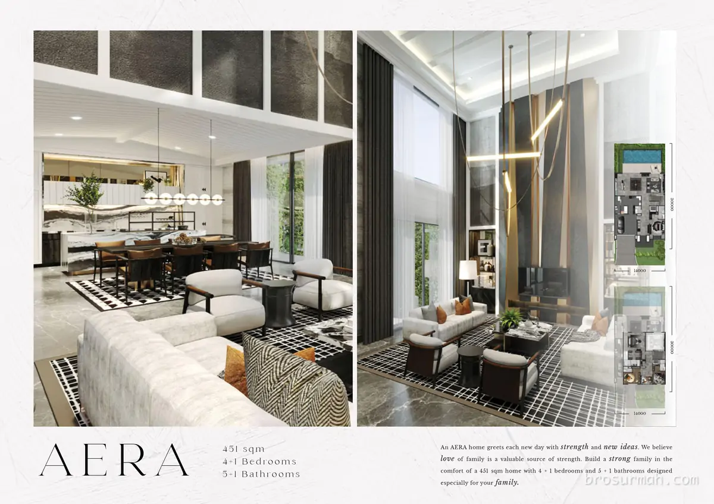
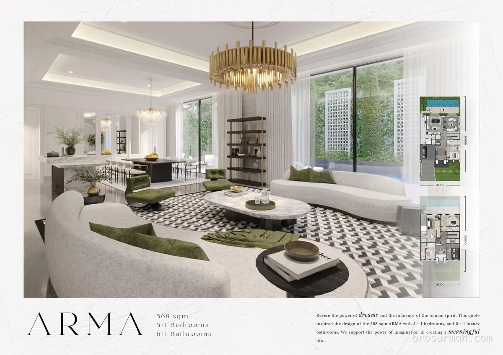
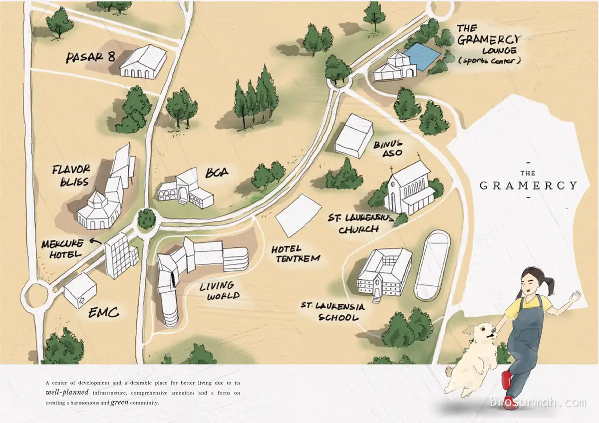

## Download Brosur Rumah Gramercy Alam Sutera
Download **brosur rumah Gramercy Alam Sutera** yang telah dirilis perdana oleh pengembang [Alam Sutera](https://alam-sutera.com#?) secara resmi. 

## Mengenai Rumah Gramercy Alam Sutera
**Gramercy** perumahan baru Alam Sutera Tangerang launching perdana 2023. [Rumah Sultan Alam Sutera Gramercy dijual](https://investproperti.com/gramercy-alam-sutera-rumah-sultan-terbaru-tangerang/) dengan unit sangat terbatas. Desain fasad rumah yang megah, dengan luas tanah daripada 398 m2 s.d 598 m2.

### Siteplan Gramercy Alam Sutera
Pada gambar siteplan Gramercy Alam Sutera, anda dapat melihat posisi 3 tipe unit rumah Gramercy yang dapat konsumen pilih, yaitu **ARMA**, **AERA**, dan **ALCA** beserta dengan posisi gerbang cluster, kolam renang dan lapangan basket.

### Tipe Rumah Gramercy

Pilihan 3 rumah Gramercy Alam Sutera dijual perdana sebagai berikut:

### Tipe Alca
Tipe Alca rumah Gramercy Alam Sutera memiliki dimensi 12x30 meter, bangunan 2 lantai rumah yang luas dengan halaman belakang dan depan rumah yang *spacious*.

Spesifikasi:
- Luas tanah 360 m2
- 4+1 kamar tidur
- 5+1 kamar mandi
- luxurious bathrooms.

### Tipe Aera
Tipe Aera rumah Gramercy Alam Sutera memiliki dimensi 14x30 meter, bangunan 2 lantai rumah yang luas dengan halaman samping dan halaman belakang + kolam renang.

Spesifikasi:
- Luas tanah 451 m2
- 4+1 kamar tidur
- 5+1 kamar mandi mewah.

### Tipe Arma
Tipe Arma rumah Gramercy Alam Sutera memiliki dimensi 16x30 meter, bangunan 2 lantai rumah yang luas dengan halaman depan dan halaman belakang + kolam renang.

Spesifikasi:
- Luas tanah 568 m2
- 5+1 kamar tidur
- 6+1 kamar mandi mewah.

### Dimana Lokasi Gramercy ?
Berada di Alam Sutera, Tangerang, perumahan The Gramercy memiliki lokasi yang strategis seperti pada gambar peta lokasi dibawah. Dekat dengan sekolah Binus ASO, sekolah Laurensia, The Gramercy Lounge Sport Center, mall Living World, area komersial Flavor Bliss dan Pasar 8.

## Sales Rumah Gramercy Alam Sutera
Miliki rumah sultan Alam Sutera dengan membeli rumah Gramercy yang dijual sangat terbatas. Ingin bertanya lebih lanjut mengenai rumah Gramercy Alam Sutera yang launching perdana di tahun 2023, dapat menghubungi sales rumah Gramercy Alam Sutera yang bisa anda percaya dan selalu siap membantu anda.

Untuk info price list harga rumah Gramercy juga dapat anda tanyakan langsung juga karena dapat berubah sewaktu-waktu oleh pengembang Alam Sutera.

