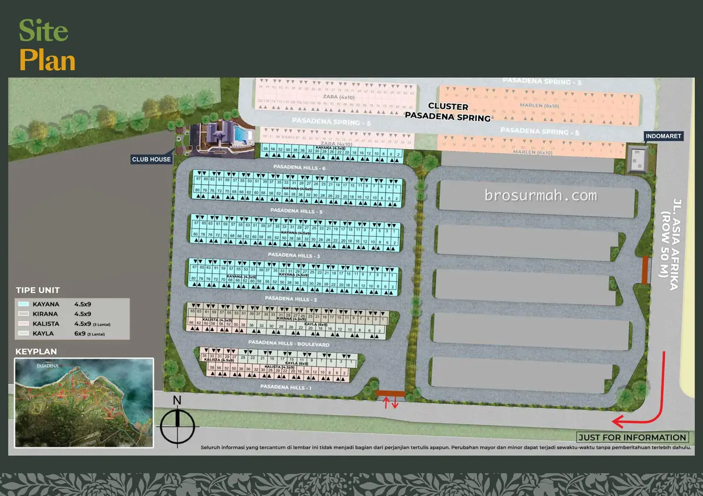

## Download Brosur Rumah Ilona @ Pasadena Hills PIK 2 Jakarta
Download **brosur rumah Ilona Pasadena Hills PIK 2** yang telah dirilis perdana oleh pengembang [Agung Sedayu Group](https://www.agungsedayu.com/en#?) secara resmi di tahun 2023.

## Mengenai Rumah Ilona @ Pasadena Hills
**PIK 2** kembali menawarkan hunian rumah dengan harga terjangkau di [perumahan Pasadena Hills](/docs/brosur-rumah-casa-pasadena-pik-2-jakarta/). **Ilona**, rumah baru di Pasadena Hills PIK 2 launching perdana 2023 dengan 3 pilihan tipe rumah, lebar 4,5 dan 6 meter dengan panjang 9 meter. 

**Harga jual rumah Pasadena Hills PIK 2 Ilona** saat launching perdana mulai Rp. 1,3 milyaran*. [Rumah Pasadena Hills PIK 2](https://investproperti.com/casa-pasadena-pik-2-jakarta/) dengan desain modern minimalis dan tata ruang yang compact, cocok bagi generasi milenial, z-nial yang sedang mencari rumah pertama. 

Untuk harga jual rumah Pasadena Hills terbaru, bisa langsung hubungi [sales rumah PIK 2](https://pik2home.com/hubungi-kami/) ya.

**Pasadena Hills PIK 2** dikelilingi oleh berbagai fasilitas lengkap, seperti Millenial Park, Eco Park (taman kota dengan danau luas), supermarket, sekolah, dan lainnya.

### Danau & Eco Park

Memadukan ruang terbuka hijau yang ramah lingkungan, dipadu dengan tata ruang landscape yang memberikan udara sehat bagi penghuni perumahan PIK 2. Itulah fitur Danau & Eco Park PIK 2.

### Pasar Segar

Pasar Segar Milenial PIK 2 menyediakan kebutuhan sehari-hari yang lengkap bagi penghuni perumahan. 

## Dijual Rumah Ilona @ Pasadena Hills PIK 2

Memasuki gerbang perumahan, penghuni disambut dengan gerbang perumahan yang megah dan mewah, dengan pos satpam perumahan di tengah dan palang otomatis.

Saat launching perdana, rumah Ilona @ Pasadena Hills PIK 2 dijual dengan 3 pilihan tipe rumah sebagai berikut:

### Tipe Kalista
**Rumah Ilona** tipe **Kalista** memiliki dimensi 4,5x9 meter, bangunan 3 lantai rumah. Desain fasad modern, minimalis, lantai atas memiliki balkoni dan jendela yang lebar dan tinggi.

Spesifikasi rumah:
- Luas tanah 40,5 m2
- Luas bangunan 93 m2
- 3 kamar tidur
- 3 kamar mandi
- 1 carport.

### Tipe Kayla
**Rumah Ilona** tipe **Kayla** memiliki dimensi 6x9 meter, bangunan 3 lantai rumah. Desain fasad modern, minimalis, lantai atas memiliki balkoni dan jendela yang lebar dan tinggi.

Spesifikasi rumah:
- Luas tanah 54 m2
- Luas bangunan 117 m2
- 3 kamar tidur
- 3 kamar mandi
- 1 carport.

### Tipe Kirana
**Rumah Ilona** tipe **Kirana** memiliki dimensi 4,5x9 meter, bangunan 2 lantai rumah. Desain fasad modern, minimalis, lantai atas memiliki balkoni dan jendela yang lebar dan tinggi.

Spesifikasi rumah:
- Luas tanah 40,5 m2
- Luas bangunan 75 m2
- 2 kamar tidur
- 2 kamar mandi
- 1 carport.

**Rumah Pasadena Hills PIK 2** belum dilengkapi dengan atap kanopi mobil. Anda dapat memilih [atap alderon](https://atap-alderon.co.id/) sebagai atap pelindung mobil di halaman depan rumah baru anda.

### Siteplan Pasadena Hills PIK 2

### Dimana Lokasi Pasadena Hills PIK 2 ?
Berada di kawasan [PIK 2 Jakarta](https://pik2home.com), perumahan Pasadena Hills PIK 2 berlokasikan strategis melihat gambar peta dibawah. Posisi perumahan ditengah PIK 2 diapit 2 akses jalan interchange.

Pada gambar **lokasi Pasadena Hills PIK 2** rumah **Ilona**, posisi perumahan bersebelahan dengan [cluster Pasadena Spring](https://pik2home.com/proyek/pasadena-spring-pik-2/), berdekatan dengan Danau & Eco Park.

## Sales Rumah PIK 2 Jakarta
Anda berminat untuk membeli rumah Ilona Pasadena Hills atau ingin bertanya lebih lanjut mengenai produk hunian rumah baru PIK 2 launching perdana di tahun 2023 ini, dapat menghubungi sales rumah PIK2 yang bisa anda percaya dan selalu siap membantu anda.

Untuk info price list harga rumah Pasadena Hills PIK 2 juga dapat anda tanyakan langsung juga karena dapat berubah sewaktu-waktu oleh pengembang.

