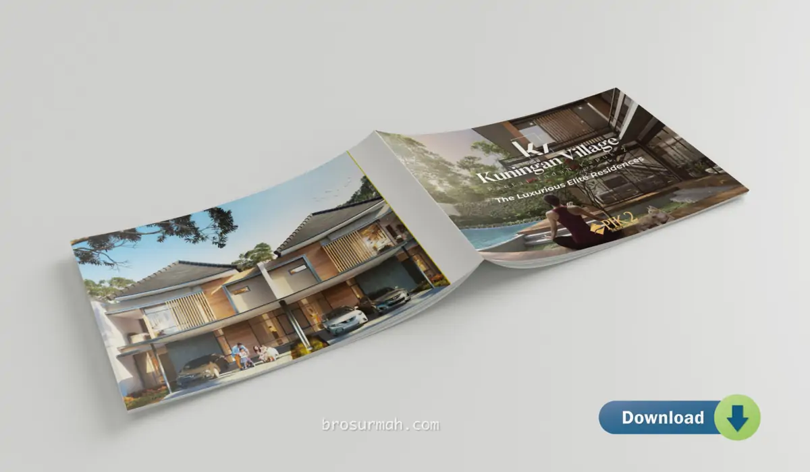
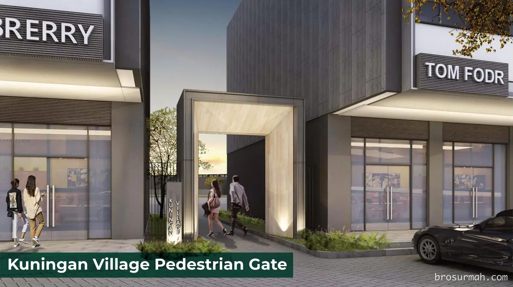

## Download Brosur Rumah Kuningan Village PIK2 Jakarta
Download **brosur rumah Kuningan Village PIK2** yang telah dirilis secara resmi oleh pengembang [Agung Sedayu Group](https://www.agungsedayu.com/en#?). Rumah Kuningan Village adalah rumah mewah ter-ekslusive di PIK2 Jakarta.

## Mengenai Kuningan Village PIK2

**Kuningan Village PIK2** adalah perumahan mewah PIK2 terbaru dengan 6 pilihan tipe rumah. Harga jual rumah Kuningan Village PIK2 mulai dari Rp. 3 milyaran*. Untuk harga terbaru, anda dapat langsung menghubungi [sales rumah PIK2](https://pik2home.com/hubungi-kami/) yang siap membantu anda untuk mendapatkan rumah idaman di PIK2.

### Lokasi Kuningan Village PIK2

[Kuningan Village PIK2](https://pik2home.com/proyek/kuningan-village-pik2/) berlokasikan di jalan utama PIK2 yaitu Jln. Jend. Sudirman yang merupakan jalan utama dari selatan ke utara PIK2 dan menghubungkan kawasan pengembangan lanjutan PIK2 seluas ribuan hektar. Pada gambar master plan PIK 2, terlihat lokasi Kuningan Village PIK2 yang berdekatan dengan CBD PIK2, Mata Elang Intl. Stadium dan kawasan komersial Marina Bay PIK2

Melihat lebih lanjut pada peta lokasi Kuningan Village PIK2, menuju ke lokasi dapat menggunakan beberapa pillihan akses yang beragam ditambah dengan rencana tol PIK 2 (sejauh 2km) akan semakin memudahkan penghuni Kuningan Village pada masa mendatang.

### Fasilitas Sekitar Kuningan Village PIK2

Fasilitas lengkap yang dapat ditempuh dengan berjalan kaki memberikan kemudahan dan kenyamanan lebih penghuni Kuningan Village. Dapat dilihat beberapa fasilitas PIK2 yang mengelilingi kawasan perumahan seperti:
- Asian Town
- Tiong Bahru Market
- Chocoville
- Grand Shanghai
- Supermarket Khas Tiongkok.

Kemudahan menuju ke berbagai fasilitas diatas, terlihat pada ilustrasi dimana dengan berjalan kaki saja, jarak tempuh menuju ke:
- Asian town 2 menit saja
- Chochoville berjarak 8 menit
- Tiong Bahru Market berjarak 9 menit
- Grand Shanghai berjarak 11 menit
- Supermarket khas Tiongkok berjarak 15 menit.

Jalan pedestrian bawah jembatan tersedia yang memudahkan akses jalan menuju ke Tiong Bahru market, Grand Shanghai dan supermarket khas Tiongkok.

### Club House Kuningan Village PIK2

Menambah kenyamanan hidup penghuni cluster Kuningan Village, club house lengkap dengan kolam renang tersedia bagi penghuni rumah.

### Tipe Rumah Kuningan Village PIK2

Rumah mewah PIK 2 terbaru [Kuningan Village](https://investproperti.com/ardea-rumah-mewah-summarecon-serpong-heron-the-spring/) menawarkan 6 pilihan tipe rumah bagi konsumen.

#### Tipe Carnelian 6x15

Rumah Carnelian Kuningan Village PIK2 memiliki spesifikasi:
- 2 lantai bangunan
- Luas tanah 90 m2
- Luas bangunan 106 m2.

#### Tipe Garnet 8x15

Rumah Garnet Kuningan Village PIK2 memiliki spesifikasi:
- 2 lantai bangunan
- Luas tanah 120 m2
- Luas bangunan 157 m2.

#### Tipe Jasper 8x20

Rumah Jasper Kuningan Village PIK2 memiliki spesifikasi:
- 2 lantai bangunan
- Luas tanah 160 m2
- Luas bangunan 175 m2.

#### Tipe Amethyst 8x25

Rumah Amethyst Kuningan Village PIK2 memiliki spesifikasi:
- 2 lantai bangunan
- Luas tanah 200 m2
- Luas bangunan 203 m2.

#### Tipe Marble 10x15

Rumah Marble Kuningan Village PIK2 memiliki spesifikasi:
- 2 lantai bangunan
- Luas tanah 150 m2
- Luas bangunan 192 m2.

#### Tipe Spinel 10x20

Rumah Spinel Kuningan Village PIK2 memiliki spesifikasi:
- 2 lantai bangunan
- Luas tanah 200 m2
- Luas bangunan 220 m2.

#### Tipe Jade 10x25

Rumah Jade Kuningan Village PIK2 memiliki spesifikasi:
- 3 lantai bangunan
- Luas tanah 250 m2
- Luas bangunan 330 m2.

### Siteplan Cluster Kuningan Village PIK2

Pada gambar siteplan Mega Kuningan PIK 2 dapat dilihat posisi unit rukan dan rumah Kuningan Village yang dipasarkan dan lokasi rumah yang hanya diseberang Asian Town & Mata Elang International Stadium PIK 2.

## Sales Rumah PIK 2
Anda berminat untuk membeli rumah mewah PIK 2 Kuningan Village atau ingin bertanya lebih lanjut, dapat menghubungi sales rumah PIK2 langsung.

Untuk info price list harga rumah Kuningan Village PIK2 juga dapat anda tanyakan langsung juga karena dapat berubah sewaktu-waktu oleh pengembang.



