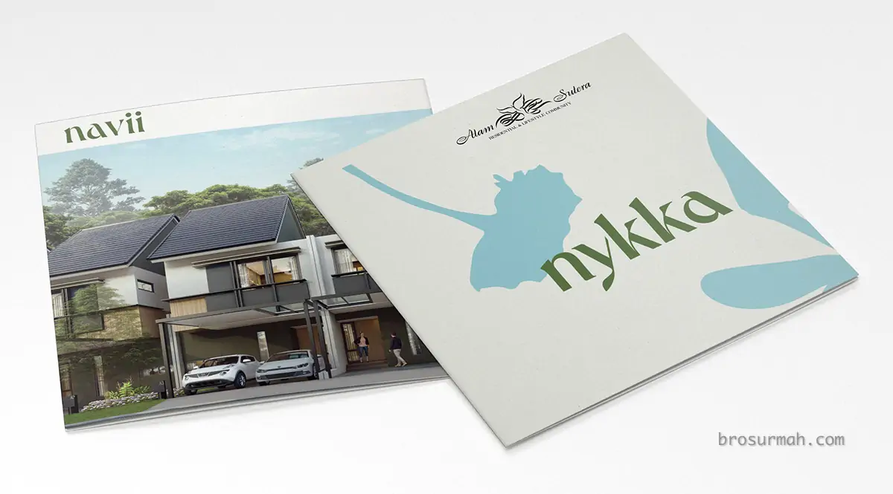
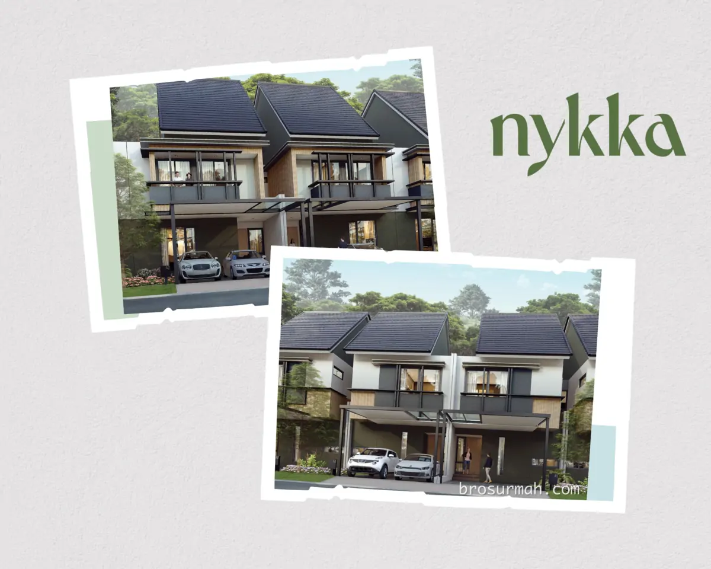
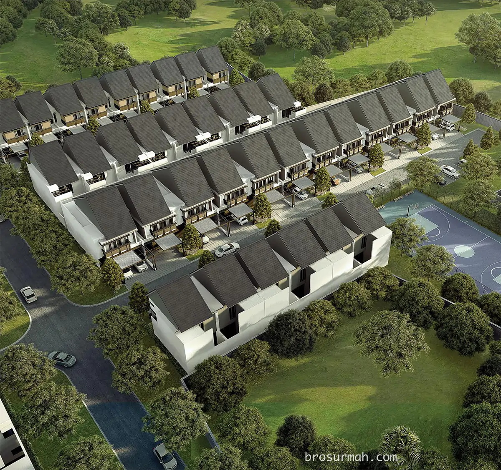
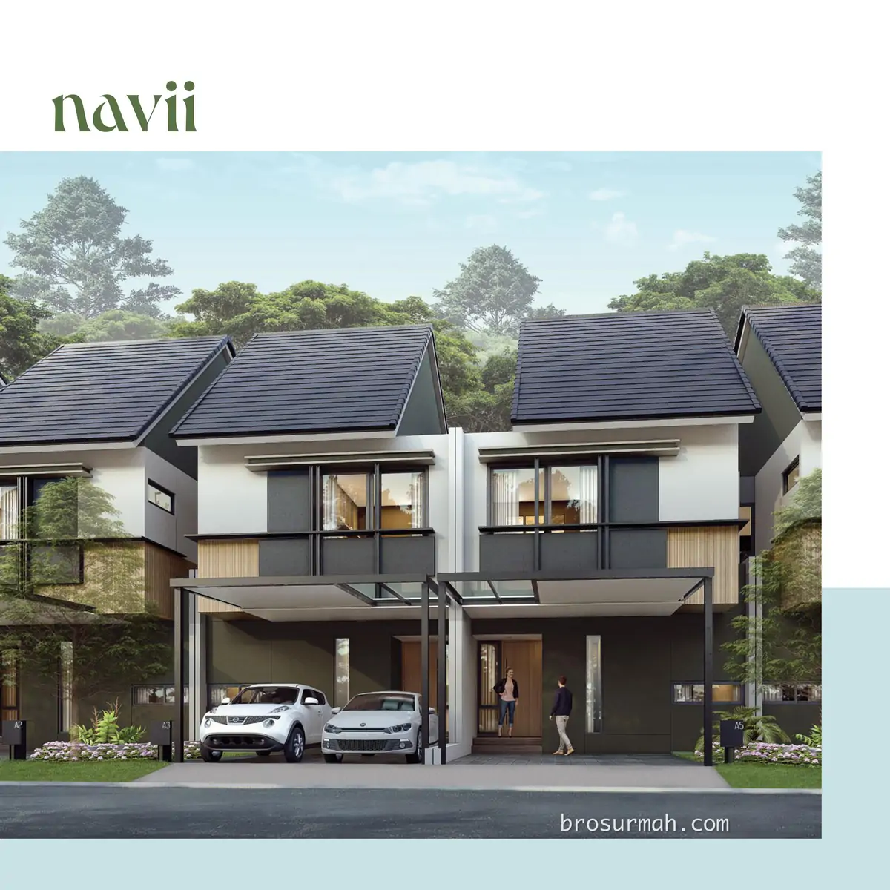
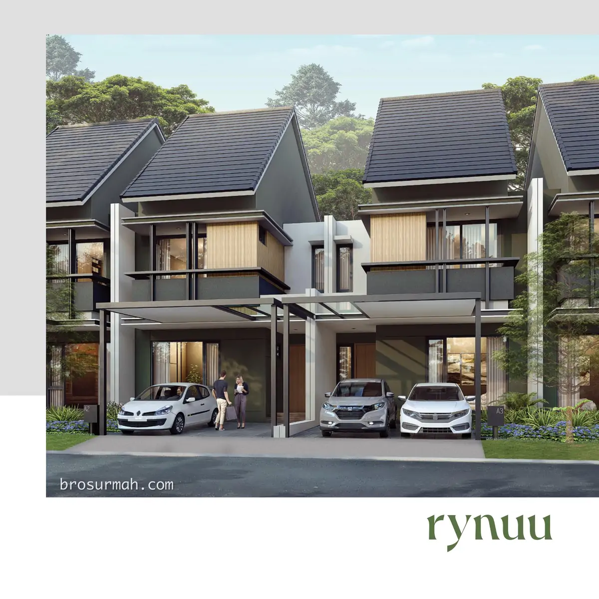
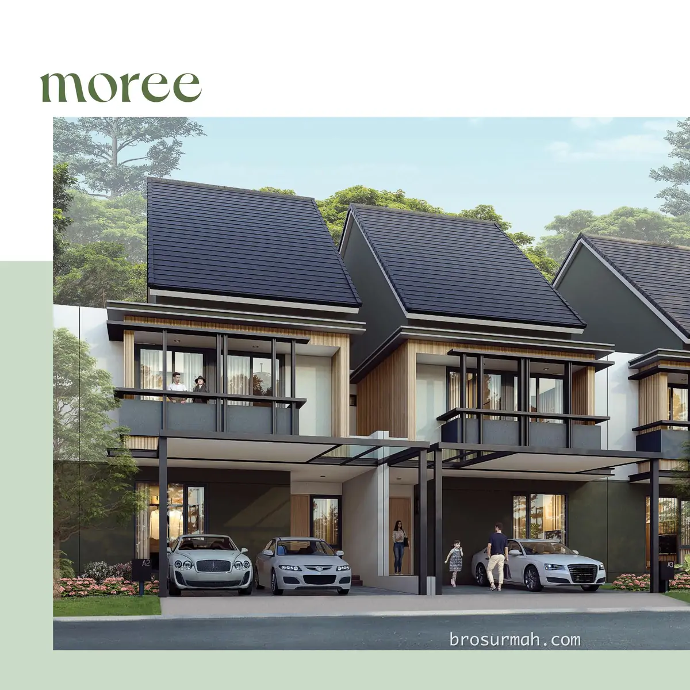
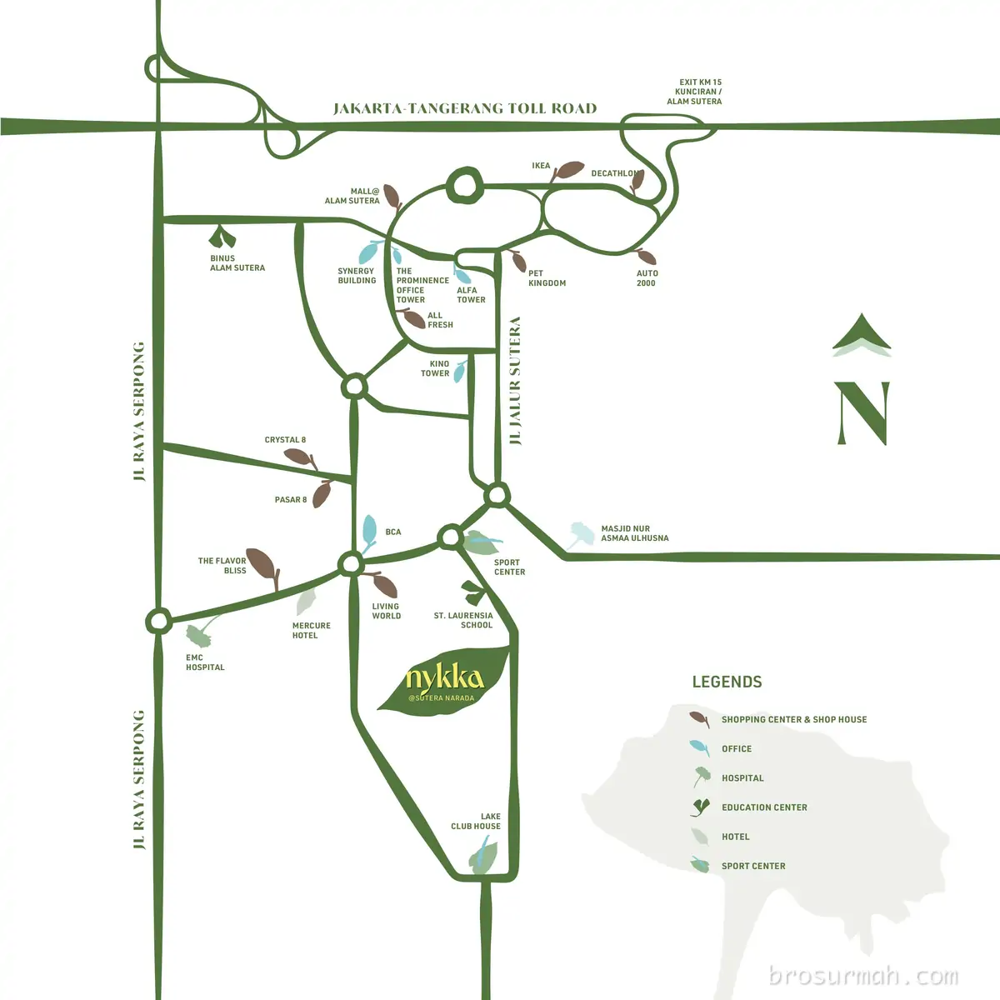

## Download Brosur Rumah Nykka Alam Sutera
Download **brosur rumah Nykka Alam Sutera** yang telah dirilis perdana oleh pengembang [Alam Sutera](https://alam-sutera.com#?) secara resmi. 

## Mengenai Rumah Nykka Alam Sutera
**Nykka** cluster terbaru Alam Sutera Tangerang launching perdana 2023. Rumah Nykka memiliki desain rumah minimalis dengan ruang keluarga yang *spaciuos* dan halaman depan muat 2 mobil.

[Rumah Nykka Alam Sutera dijual](https://investproperti.com/nykka-alam-sutera-tangerang-rumah-baru-sutera-narada/) dengan unit yang sangat terbatas seperti yang dapat dilihat pada gambar *bird eye view* perumahan.

Terdapat 3 tipe rumah yang dipasarkan saat ini, yaitu:
### Tipe Navii
Tipe Navii rumah Nykka Alam Sutera memiliki dimensi 7x15+ meter, bangunan 2 lantai rumah. Konsep *open* pada lantai bawah memberikan keleluasaan bagi penghuni untuk mengakses ruang keluarga, ruang makan dan dapur.

Spesifikasi:
- Luas tanah 105+ m2
- Luas bangunan 135 m2
- 3+1 kamar tidur
- 2+1 kamar mandi
- 2 carpot

### Tipe Rynuu

Tipe Rynuu rumah Nykka Alam Sutera memiliki dimensi 7x20 meter, bangunan 2 lantai rumah. Konsep *open* pada lantai bawah memberikan keleluasaan bagi penghuni untuk mengakses ruang keluarga, ruang makan dan dapur. Area halaman belakang memiliki balkoni lebih yang dapat mengakomodasi meja makan dengan 4 kursi.

Spesifikasi:
- Luas tanah 140 m2
- Luas bangunan 176 m2
- 4+1 kamar tidur
- 3+1 kamar mandi
- 2 carpot

### Tipe Moree

Tipe Moree rumah Nykka Alam Sutera memiliki dimensi 8x20 meter, bangunan 2 lantai rumah. Ruangan lantai bawah yang *spacious* memberikan keleluasaan bagi penghuni untuk mengakses ruang keluarga, ruang makan dengan akses langsung ke *dry kitchen* yang cukup besar untuk memiliki *island*. Terdapat juga area *wet kitchen* dan halaman belakang lebih yang dapat digunakan sebagai area BBQ luar ruangan.

Spesifikasi:
- Luas tanah 160 m2
- Luas bangunan 209 m2
- 4+1 kamar tidur
- 3+1 kamar mandi
- 2 carpot

### Dimana Lokasi Nykka ?
Berada di Alam Sutera, Tangerang, cluster Nykka memiliki lokasi yang strategis seperti pada gambar peta lokasi dibawah. Dekat dengan sekolah St. Laurensia, mall Living World, Sport Center, Lake Club House, area komersial Pasar 8 dan Crystal 8 juga The Flavor Bliss.

## Sales Rumah Nykka Alam Sutera
Anda berminat untuk membeli rumah Nykka Alam Sutera atau ingin bertanya lebih lanjut mengenai produk hunian rumah baru Alam Sutera yang launching perdana di tahun 2023 ini, dapat menghubungi sales rumah Nykka yang bisa anda percaya dan selalu siap membantu anda.

Untuk info price list harga rumah Nykka juga dapat anda tanyakan langsung juga karena dapat berubah sewaktu-waktu oleh pengembang Alam Sutera.

