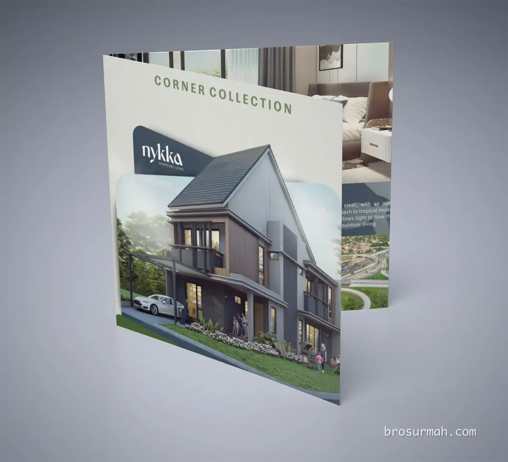
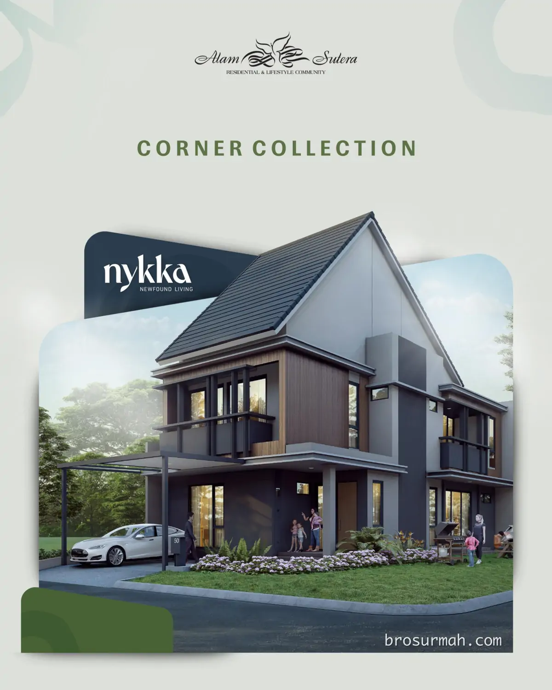
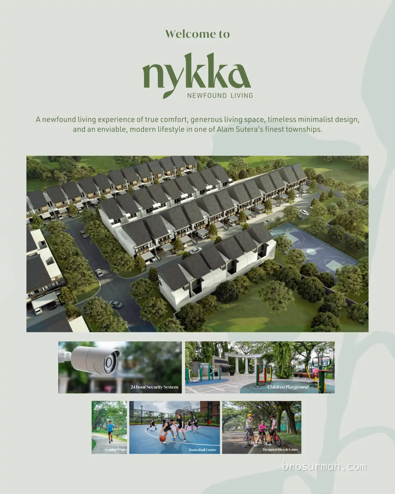
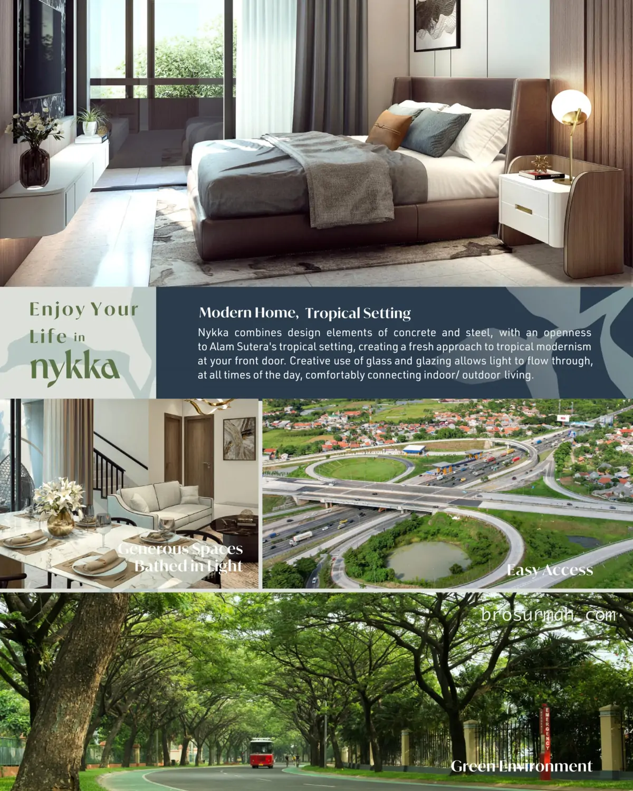
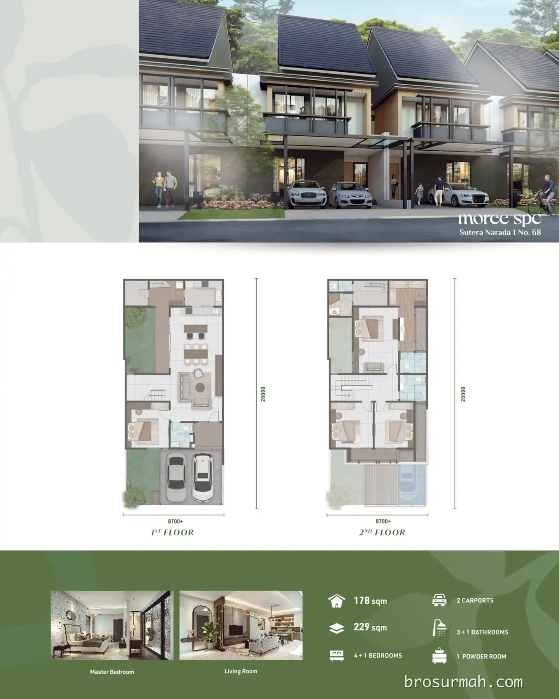
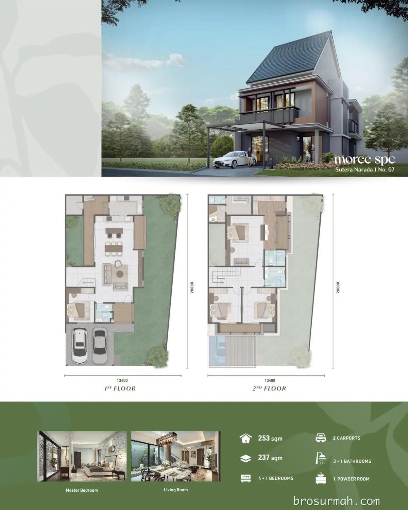
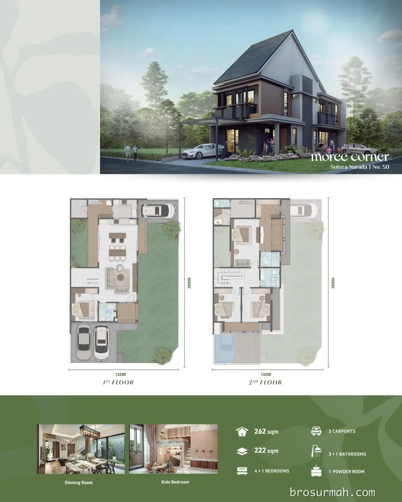
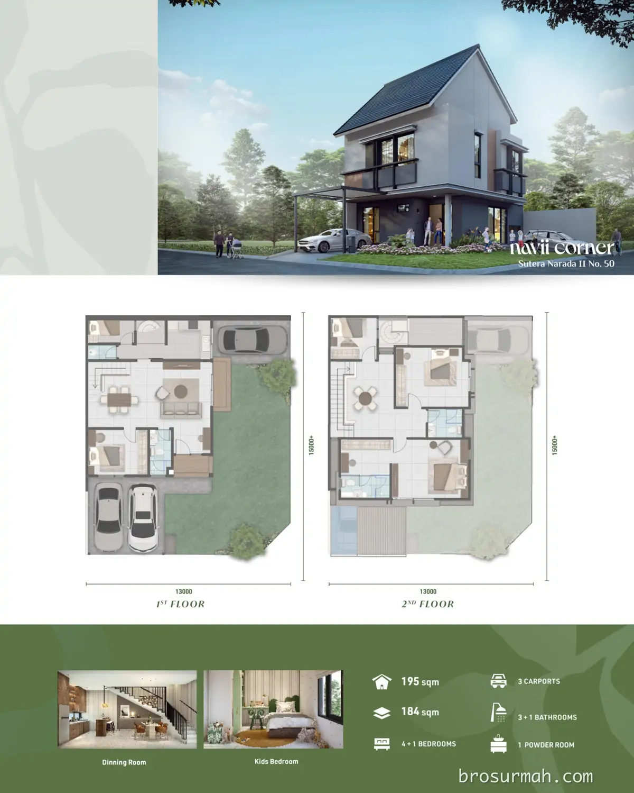
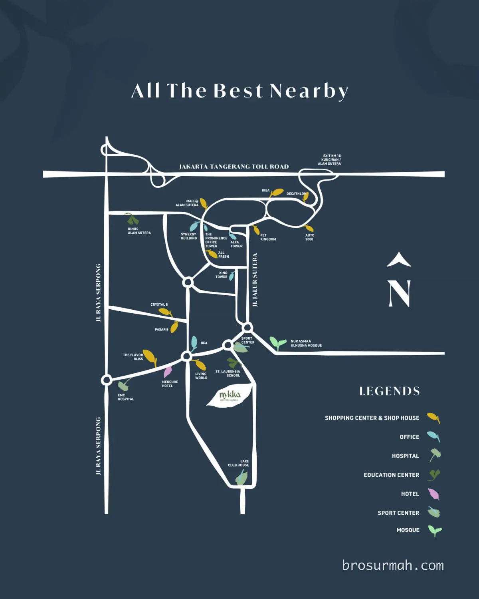

## Download Brosur Rumah Nykka Alam Sutera Tipe Sudut
Download **brosur rumah Nykka Alam Sutera** tipe **Sudut** yang telah dirilis secara resmi oleh pengembang [Alam Sutera](https://alam-sutera.com#?). Tipe sudut rumah Nykka Alam Sutera dijual sangat terbatas unitnya. 

## Mengenai Rumah Nykka Alam Sutera
**Nykka** cluster terbaru Alam Sutera Tangerang launching perdana 2023. [Rumah Nykka Alam Sutera](https://brosurmah.com/docs/brosur-rumah-nykka-alam-sutera-tangerang/) berdesain minimalis, ruangan rumah yang lega dengan halaman depan muat 2 mobil.

**Cluster perumahan Nykka Alam Sutera** menawarkan kenyamanan hidup dalam lingkungan cluster yang hijau dengan fasilitas taman bermain anak, lapangan basket, 24 jam kamera security.

**Rumah Nykka** menggabungkan elemen desain *concrete* dan *steel* ditambah dengan kreativitas elemen kaca jendela, memastikan cahaya matahari dapat dengan leluasa masuk dalam ruangan rumah.

### Tipe Rumah Nykka Alam Sutera

Pilihan rumah Nykka Alam Sutera yang masih tersedia saat ini adalah:

**Tipe Moree Spc No. 68**
Rumah Nykka Alam Sutera tipe Moree no 68 memiliki dimensi luas tanah 8,7x20 meter.

Spesifikasi:
- Luas tanah 229 m2
- Luas bangunan 178 m2
- 4+1 kamar tidur
- 3+1 kamar mandi
- 1 powder room
- 2 carport.

**Tipe Moree Spc No. 67**
Rumah Nykka Alam Sutera tipe Moree no 67 memiliki irregular shape.

Spesifikasi:
- Luas tanah 237 m2
- Luas bangunan 253 m2
- 4+1 kamar tidur
- 3+1 kamar mandi
- 1 powder room
- 2 carport.

**Tipe Moree Sudut No. 50**
Rumah Nykka Alam Sutera tipe Moree Sudut no 50 memiliki irregular shape.

Spesifikasi:
- Luas tanah 222 m2
- Luas bangunan 262 m2
- 4+1 kamar tidur
- 3+1 kamar mandi
- 1 powder room
- 3 carport.

**Tipe Navii Sudut No. 50**
Rumah Nykka Alam Sutera tipe Navii Sudut no 50 memiliki irregular shape.

Spesifikasi:
- Luas tanah 184 m2
- Luas bangunan 195 m2
- 4+1 kamar tidur
- 3+1 kamar mandi
- 1 powder room
- 3 carport.

### Dimana Lokasi Nykka ?
Berada di Alam Sutera, Tangerang, cluster Nykka memiliki lokasi yang strategis seperti pada gambar peta lokasi dibawah. Dekat dengan sekolah St. Laurensia, mall Living World, Sport Center, Lake Club House, area komersial Pasar 8 dan Crystal 8 juga The Flavor Bliss.

## Sales Rumah Nykka Alam Sutera
Anda berminat untuk membeli [rumah Nykka Alam Sutera](https://investproperti.com/nykka-alam-sutera-tangerang-rumah-baru-sutera-narada/) atau ingin bertanya lebih lanjut mengenai produk hunian rumah baru Alam Sutera yang launching perdana di tahun 2023 ini, dapat menghubungi sales rumah Nykka yang bisa anda percaya dan selalu siap membantu anda.

Untuk info price list harga rumah Nykka juga dapat anda tanyakan langsung juga karena dapat berubah sewaktu-waktu oleh pengembang Alam Sutera.

