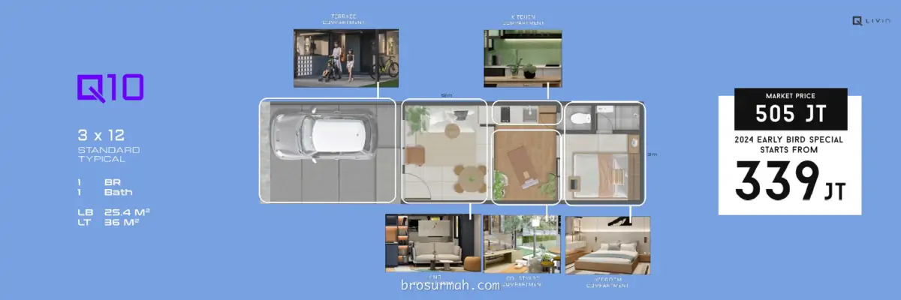

## Download Brosur Rumah Park Serpong Zen Series
**Lippo Karawaci group** pada awal Q1 2024 merilis produk hunian **Zen Series @ Park Serpong** dengan tipe rumah baru. **Download brosur rumah Park Serpong Zen Series** sekarang juga untuk melihat tipe rumah apa saja yang tersedia, seperti apa desain rumah, fasilitas yang tersedia dan info lainnya.

## Rumah Park Serpong Zen Series
Melihat animo konsumen yang begitu besar dengan [rumah XYZ Livin](https://park-serpong.id/portfolio/xyz-livin-park-serpong/) dan [Cendana Livin](https://park-serpong.id/portfolio/cendana-livin-park-serpong/), [Park Serpong](https://park-serpong.id) meluncurkan produk hunian baru Zen Series dengan **rumah Q Livin**, dan tipe baru rumah XYZ dan Cendana Livin.

## Rumah Q Livin Park Serpong
Tipe rumah Park Serpong Q Livin memiliki tema ***"Modern Courtyard Homes"***. Saat launching pertama kali, rumah Q Livin Park Serpong dijual pada harga rumah Rp. 339 jutaan* (harga promo). Desain rumah dengan ***courtyard*** dalam rumah memberikan ruangan terbuka yang memberikan kelancaran sirkulasi udara dan pencahayaan alami yang lebih dirumah.

Konsumen dapat memilih 4 tipe rumah Q Livin yang tersedia.

### Tipe Q10
Rumah Q Livin Park Serpong tipe Q10 berspesifikasikan:
- 1 lantai
- Dimensi 3 x 12 (tipe standard)
- Luas tanah 36 m2
- Luas bangunan 25,4 m2
- 1 kamar tidur
- 1 kamar mandi

### Tipe Q11
Rumah Q Livin Park Serpong tipe Q11 berspesifikasikan:
- 1 lantai
- Dimensi 3,3 x 12 (tipe standard)
- Luas tanah 39,6 m2
- Luas bangunan 27,7 m2
- 1 kamar tidur
- 1 kamar mandi

### Tipe Q20
Rumah Q Livin Park Serpong tipe Q20 berspesifikasikan:
- 2 lantai
- Dimensi 3,3 x 13 (tipe standard)
- Luas tanah 42,9 m2
- Luas bangunan 46,7 m2
- 2 kamar tidur
- 2 kamar mandi

### Tipe Q21
Rumah Q Livin Park Serpong tipe Q21 berspesifikasikan:
- 2 lantai
- Dimensi 3,3 x 16 (tipe standard)
- Luas tanah 46,8 m2
- Luas bangunan 50,5 m2
- 2 kamar tidur
- 2 kamar mandi

## Rumah XYZ Livin Park Serpong
Tipe rumah Park Serpong XYZ Livin memiliki tema ***"Modern Artistic Homes"***. 
Pada Zen Series, rumah XYZ Livin Park Serpong dipasarkan dengan tipe terbarunya yaitu:

### Tipe X3
Rumah X Livin Park Serpong tipe X3 berspesifikasikan:
- 2 lantai
- Dimensi 5 x 11,3 (tipe standard)
- Luas tanah 56,5 m2
- Luas bangunan 66,9 m2
- 3 kamar tidur
- 2,5 kamar mandi

### Tipe X5
Rumah X Livin Park Serpong tipe X5 berspesifikasikan:
- 2 lantai
- Dimensi 5 x 12,3 (tipe standard)
- Luas tanah 70,6 m2
- Luas bangunan 61,5 m2
- 3 kamar tidur
- 2,5 kamar mandi

Beberapa contoh desain interior ruangan rumah X Park Serpong:

## Rumah Cendana Livin Park Serpong
Tipe rumah Park Serpong Cendana Livin memiliki tema ***"Modern Stylish Homes"***. 

Pada Zen Series, rumah Cendana Livin Park Serpong dipasarkan dengan tipe terbarunya yaitu:

### Tipe 2+
Rumah Cendana Livin Park Serpong tipe 2+ berspesifikasikan:
- 2 lantai
- Dimensi 5 x 15 (tipe standard)
- Luas tanah 82,5 m2
- Luas bangunan 74,5 m2
- 3 kamar tidur
- 3 kamar mandi

### Tipe 3+
Rumah Cendana Livin Park Serpong tipe 3+ berspesifikasikan:
- 2 lantai
- Dimensi 6,5 x 15 (tipe standard)
- Luas tanah 97,5 m2
- Luas bangunan 92,2 m2
- 3 kamar tidur
- 3 kamar mandi

## Sales Rumah Park Serpong
Jika anda sedang mencari rumah baru di dekat Gading Serpong, Tangerang launching perdana 2024, hubungi [sales rumah Park Serpong](https://park-serpong.id/hubungi-kami/) sekarang juga untuk membeli rumah Zen Series Park Serpong.

Untuk info price list harga [rumah Park Serpong Zen Series](https://investproperti.com/rumah-park-serpong-zen-series-q-livin-xyz-livin-dan-cendana-livin/) juga dapat anda tanyakan langsung juga karena dapat berubah sewaktu-waktu oleh pengembang.



