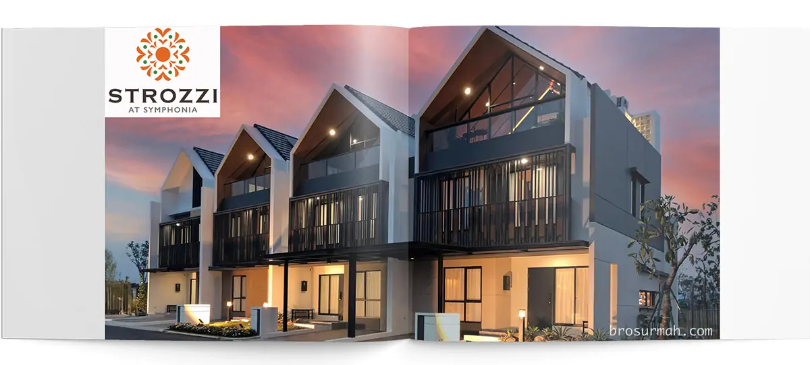
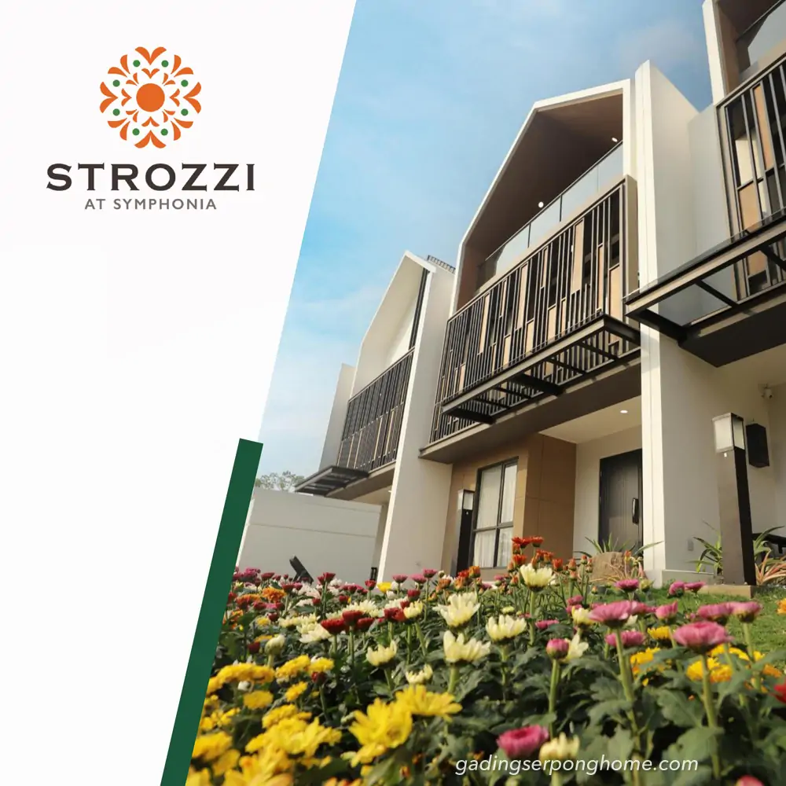
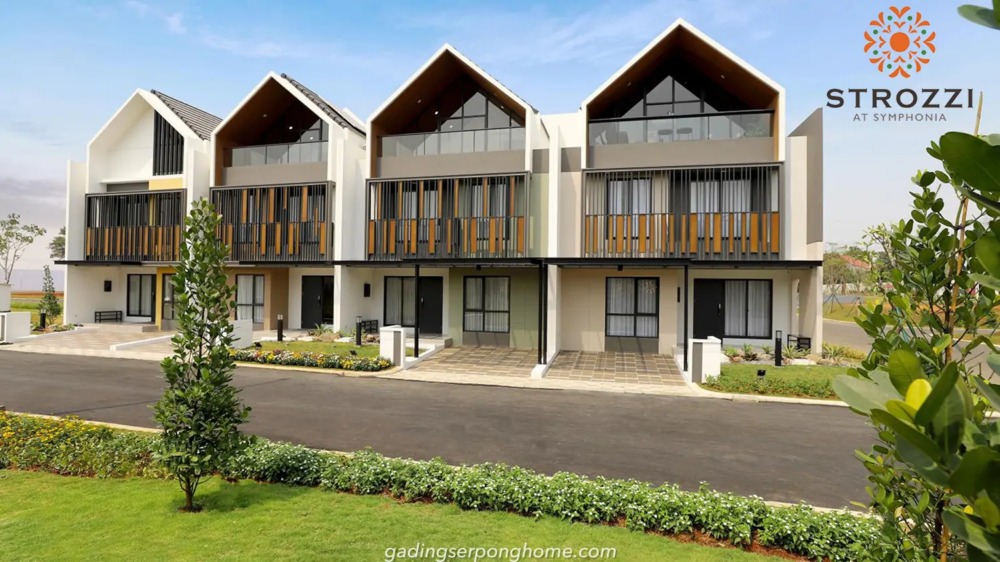
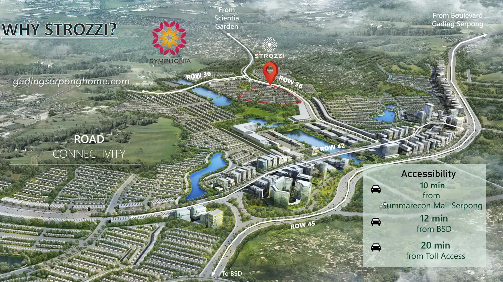
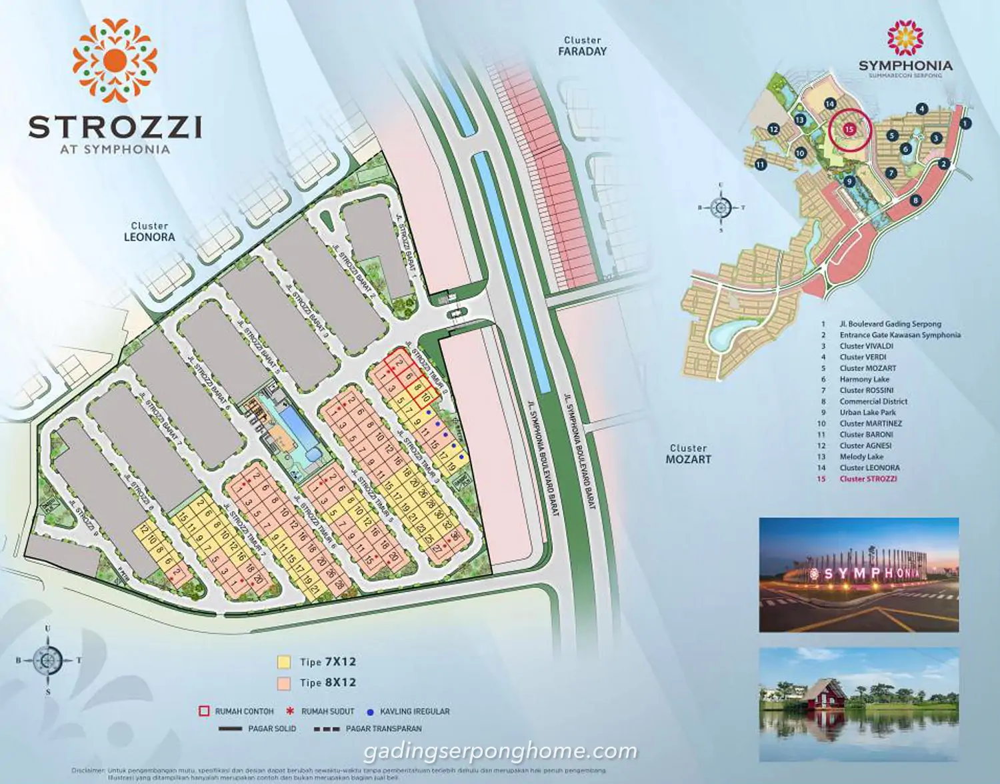
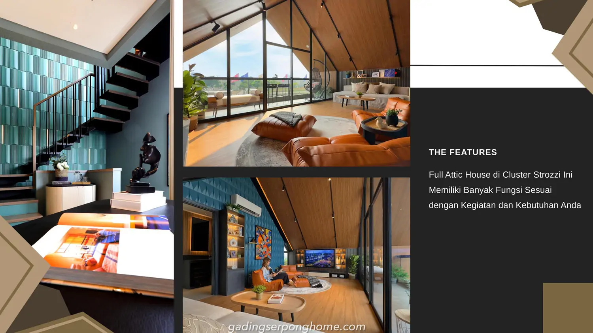

## Download Brosur Rumah Strozzi Symphonia Summarecon Serpong
Download **brosur rumah Strozzi Symphonia Summarecon Serpong** yang telah dirilis perdana oleh pengembang [Summarecon](https://summareconserpong.com#?) secara resmi. 

## Mengenai Cluster Strozzi Symphonia Summarecon Serpong
**Strozzi** cluster terbaru Symphonia Summarecon Serpong launching perdana 2023. Konsep rumah "real attic" dimiliki oleh [rumah Strozzi Symphonia Summarecon Serpong](https://gadingserponghome.com/baru/strozzi-at-symphonia-summarecon-serpong/) dengan lantai attic yang luas dan memiliki balkoni seperti yang dapat dilihat pada foto rumah contoh Strozzi dibawah.

**Summarecon Serpong** telah membuka kesempatan bagi public / umum untuk mengunjungi secara langsung show unit rumah Strozzi mulai jam 08:00 pagi s/d 20:00 malam setiap harinya mulai 23-Oktober-2023.

### Dimana Lokasi Cluster Strozzi ?
Rumah cluster baru Symphonia Summarecon Serpong Strozzi berada di kota mandiri Gading Serpong, Tangerang. Akses menuju ke lokasi perumahan dapat dicapai melalui beberapa pilihan jalan seperti
- dari Boulevard Gading Serpong berjarak 10 menit dari mall SMS
- dari BSD City hanya 12 menit
- dari akses tol hanya 20 menit saja.

### Siteplan Cluster Strozzi Summarecon Serpong
Terlihat secara lebih jelas, posisi cluster Strozzi di kawasan perumahan nuansa danau Symphonia Summarecon Serpong. Lokasi cluster berdekatan dengan Melody Lake dan Urban Lake Park juga berseeblahan dengan [cluster Leonora](https://investproperti.com/cluster-leonora-symphonia-summarecon-serpong/).

### Apa Keunggulan Rumah Strozzi ?
[Rumah Strozzi](https://www.propertilaunch.com/2023/10/strozzi-symphonia-summarecon-serpong.html) dipasarkan dengan konsep rumah "real attic" dengan area lantai attic yang full dan luas. Sebagai ilustrasi, melihat foto show unit rumah attic Strozzi yang dijadikan ruangan tambahan private untuk bersantai bagi penghuni rumah dengan *bean bag* atau *lazy couch*. Jendela lantai attic juga dibuat *full glass* yang lebar, memberikan pemandangan menyeluruh keluar ruangan rumah menuju ke taman.

## Sales Rumah Strozzi Summarecon Serpong
Kalau anda berminat untuk membeli rumah Strozzi atau ingin bertanya lebih lanjut mengenai produk hunian rumah baru Symphonia Summarecon Serpong cluster Strozzi, dapat menghubungi sales rumah Summarecon Serpong yang bisa anda percaya dan selalu siap membantu memberikan penjelasan mengenai produk rumah Strozzi. 

Untuk info price list harga rumah Strozzi juga dapat anda tanyakan langsung juga karena dapat berubah sewaktu-waktu oleh pengembang.



