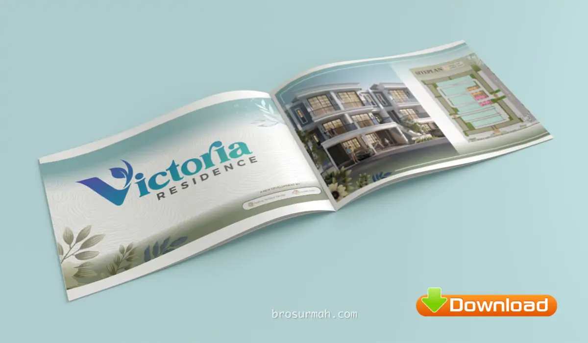
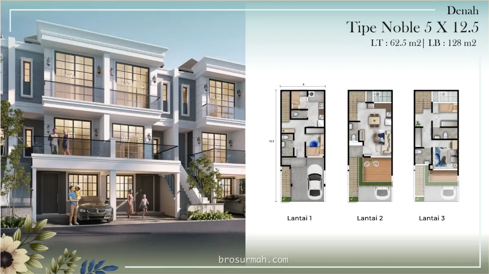
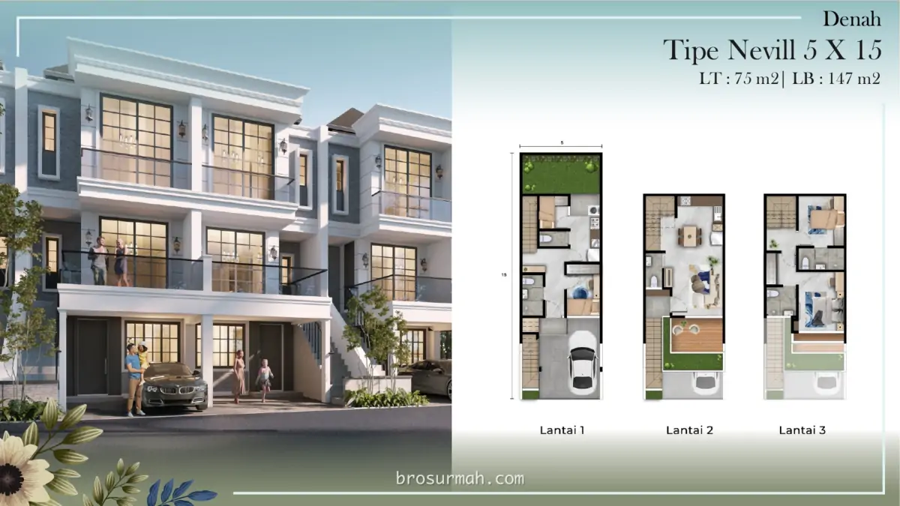
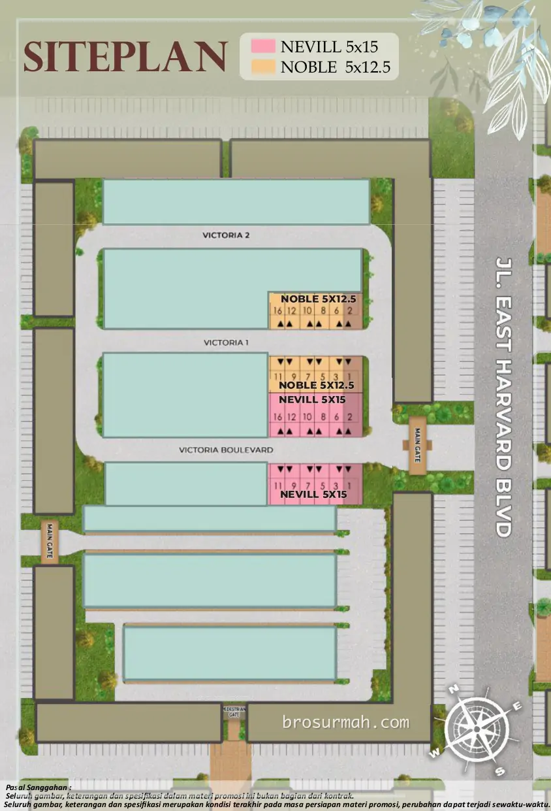
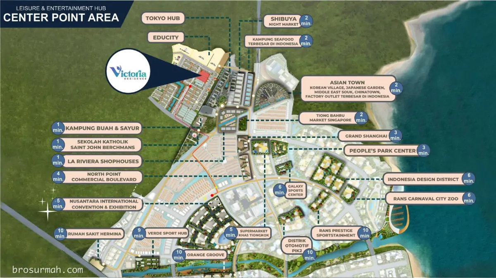
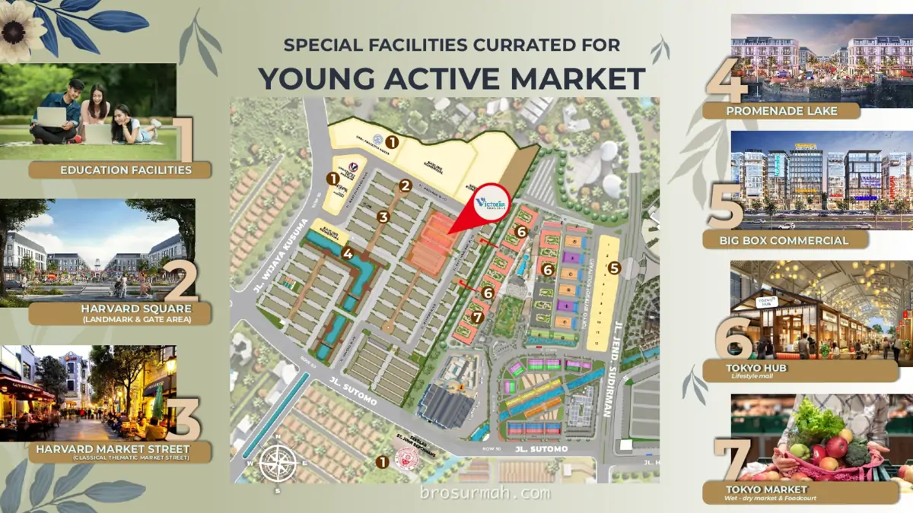

## Download Brosur Rumah Victoria Residence PIK2 Jakarta
Download **brosur rumah Victoria Residence PIK2 jakarta** launching perdana 2024 oleh pengembang [Agung Sedayu Group](https://agungsedayugroup.com#?). Rumah Victoria Residence PIK2 dijual pada harga perdana mulai dari Rp. 2,2 milyaran*.

## Cluster Victoria Residence PIK2
**Cluster Victoria Residence PIK2** menawarkan hunian rumah premium dan ekslusive dimana pada tahapan pertama dipasarkan sebanyak 24 unit rumah saja yang dapat dilihat pada gambar siteplan dibawah. Pembeli dapat memilih 2 opsi pilihan tipe rumah Victoria yaitu:

### Tipe Noble
Memiliki lebar 5 meter dan panjang 12,5 meter, [rumah Victoria PIK2](https://investproperti.com/victoria-residence-pik2-jakarta/#?) tipe **Noble** berspesifikasikan:
- Luas tanah 62,5 m2
- Luas bangunan 128 m2
- 3 lantai
- lantai dasar memiliki 1+1 kamar tidur, 1+1 kamar mandi.
- lantai 2 mmemiliki ruang keluarga, dry kitchen, 1 kamar mandi dan balkoni yang luas.
- lantai 3 dilengkapi dengan ensuite master bedroom + bathroom, kamar anak + bathroom dan balkoni.
- akses tangga terpisah langsung ke lantai 2 dari lantai dasar.

### Tipe Nevill
Memiliki lebar 5 meter dan panjang 15 meter, rumah Victoria PIK2 tipe **Nevill** berspesifikasikan:
- Luas tanah 75 m2
- Luas bangunan 147 m2
- 3 lantai
- lantai dasar memiliki 1+1 kamar tidur, 1+1 kamar mandi.
- lantai 2 mmemiliki ruang keluarga, dry kitchen, 1 kamar mandi dan balkoni yang luas.
- lantai 3 dilengkapi dengan ensuite master bedroom + bathroom, kamar anak + bathroom dan balkoni.
- akses tangga terpisah langsung ke lantai 2 dari lantai dasar.
- halaman belakang rumah yang bisa dijadikan taman.

## Siteplan Cluster Victoria Residence PIK2

## Lokasi Cluster Victoria Residence PIK2
Pada gambar master plan PIK2 terbaru, lokasi cluster Victoria Residence PIK2 hanya selangkah dari Educity PIK2, area komersial Tokyo HUB, Kampung Buah & Sayur, Shiybuya Night Market, Kampung Seafood dan sekolah Saint John Berchmans.

## Fasilitas Sekitar Victoria Residence PIK2
Beragam fasilitas lengkap mengelilingi perumahan Victoria Residence PIK2. Selain yang sudah disebutkan diatas, fasilitas lain seperti Harvard Square yang merupakan landmark dan gate area, Harvard Market Street, Promenade Lake, Bix Box Commercial, Tokyo Hub - Lifesytle mall dan Tokyo Market - wet & dry market & foodcourt juga dekat area perumahan Victoria PIK2.

## Sales Rumah Victoria Residence PIK2
Anda sedang mencari rumah baru di PIK2 Jakarta tahun 2024 ini, dan ingin membeli rumah Victoria Residence, dapat menghubungi [sales rumah PIK2](https://pik2home.com/hubungi-kami/#?) yang selalu siap membantu anda.

Untuk info price list harga rumah Victoria Residence PIK2 juga dapat anda tanyakan langsung juga karena dapat berubah sewaktu-waktu oleh pengembang Agung Sedayu Group.



