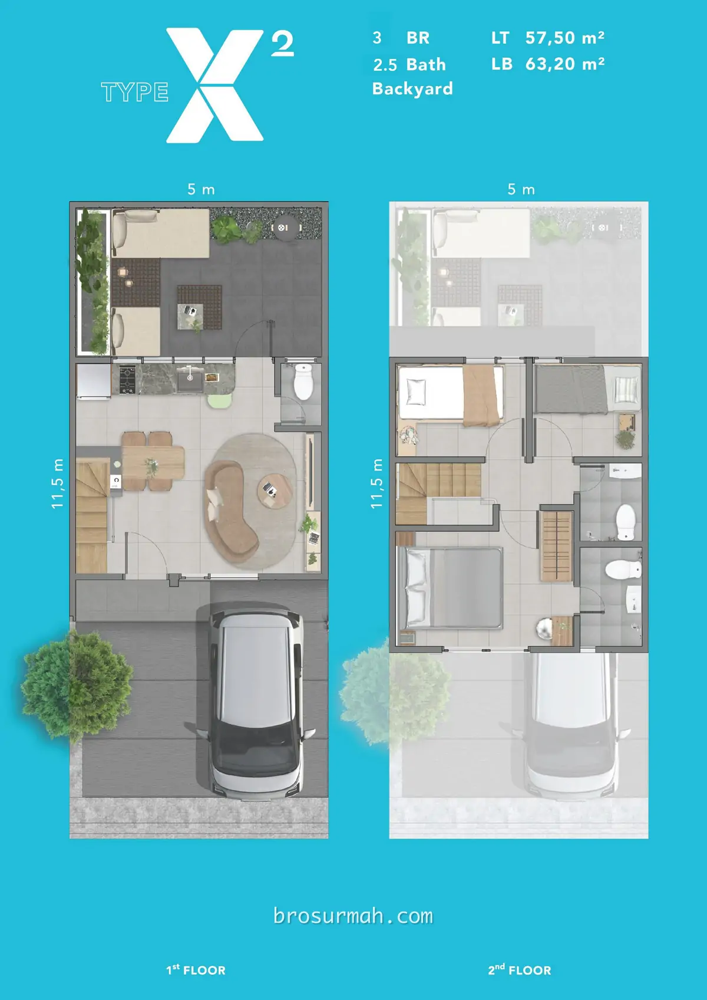

## Download Brosur Rumah XYZ Livin Park Serpong
Download **brosur rumah XYZ Livin Park Serpong** yang telah dirilis perdana oleh pengembang [Lippo Karawaci](https://www.lippokarawaci.co.id//#?) secara resmi. Launching perdana rumah Park Serpong XYZ Livin pada harga jual rumah mulai dari Rp. 299 jutaan* (harga promo*).

## Mengenai Park Serpong
**Park Serpong** adalah proyek mixed-use terbaru **PT Lippo Karawaci Tbk.* di kawasan Legok, Tangerang pada lahan seluas 400 hektar. Melihat gambar lokasi Park Serpong, dapat dilihat posisi hunian baru Lippo di Legok adalah sangat strategis dimana berada tepat di tengah kota mandiri Gading Serpong, BSD City, Citra Raya, [Paramount Petals](https://paramount-petal.com) dan Lippo Village Karawaci.

Dari Gading Serpong, menuju ke Park Serpong dapat melewati Jln. Raya Legok, Tangerang hanya berjarak 20 menit perjalanan saja. Posisi Park Serpong berdekatan dengan perumahan Symphonia Summarecon Serpong.

## Rumah XYZ Livin Park Serpong

Pada saat launching perdana, dirilis penjualan [rumah XYZ Livin Park Serpong](https://park-serpong.id/portfolio/xyz-livin-park-serpong/) pada harga jual rumah mulai Rp. 299 jutaan* saat pre-launching. Menurut kabar, telah terdaftar lebih dari 2.000 no NUP. Animo konsumen yang begitu besar untuk memiliki rumah baru Park Serpong XYZ Livin di tahun 2023.

Rumah modern artistic minimalis dan fungsional dimiliki oleh rumah XYZ Livin. Sangat cocok bagi generasi z-lenial yang sedang mencari hunian rumah pertama mereka.

Terdapat 9 tipe rumah XYZ Livin yang dijual perdana, yaitu:

### Tipe X1
2 lantai rumah tipe X1 dengan halaman belakang, dimensi 5,5 x 10,5 meter.

Spesifikasi:
- Luas tanah 52,5 m2
- Luas bangunan 60,7 m2
- 3 kamar tidur
- 2,5 kamar mandi
- 1 carpot

### Tipe X2
2 lantai rumah tipe X2 dengan halaman belakang, dimensi 5,5 x 11 meter.

Spesifikasi:
- Luas tanah 57,5 m2
- Luas bangunan 63,2 m2
- 3 kamar tidur
- 2,5 kamar mandi
- 1 carpot

### Tipe Y1
2 lantai rumah tipe Y1 memiliki dimensi 3,3 x 9.5 meter.

Spesifikasi:
- Luas tanah 31,35 m2
- Luas bangunan 40,7 m2
- 2 kamar tidur
- 1,5 kamar mandi
- 1 carpot

### Tipe Y2
2 lantai rumah tipe Y2 memiliki dimensi 3,3 x 11.5 meter dan halaman belakang.

Spesifikasi:
- Luas tanah 37,95 m2
- Luas bangunan 42 m2
- 2 kamar tidur
- 1,5 kamar mandi
- 1 carpot

### Tipe Y3
2 lantai rumah tipe Y3 memiliki dimensi 3,6 x 11.5 meter dan halaman belakang.

Spesifikasi:
- Luas tanah 41,40 m2
- Luas bangunan 45,8 m2
- 2 kamar tidur
- 1,5 kamar mandi
- 1 carpot

### Tipe Z1
2 lantai rumah tipe Z1 memiliki dimensi 3 x 9.5 meter.

Spesifikasi:
- Luas tanah 28.5 m2
- Luas bangunan 29,5 m2
- 1 kamar tidur
- 1,5 kamar mandi
- 1 carpot

### Tipe Z2
2 lantai rumah tipe Z2 memiliki dimensi 3 x 9.5 meter.

Spesifikasi:
- Luas tanah 31.35 m2
- Luas bangunan 32,3 m2
- 1 kamar tidur
- 1,5 kamar mandi
- 1 carpot

### Tipe Z3
2 lantai rumah tipe Z3 memiliki dimensi 3,3 x 11.5 meter dan halaman belakang.

Spesifikasi:
- Luas tanah 37.95 m2
- Luas bangunan 35,6 m2
- 1 kamar tidur
- 1,5 kamar mandi
- 1 carpot

## Sales Rumah Park Serpong
Anda berminat untuk membeli rumah Park Serpong atau ingin bertanya lebih lanjut mengenai produk hunian rumah baru XYZ Livin yang launching perdana di tahun 2023 ini, dapat menghubungi [sales rumah Park Serpong](https://park-serpong.id/hubungi-kami/) yang bisa anda percaya dan selalu siap membantu anda.

Untuk info price list harga rumah XYZ Livin juga dapat anda tanyakan langsung juga karena dapat berubah sewaktu-waktu oleh pengembang Lippo Karawaci.



